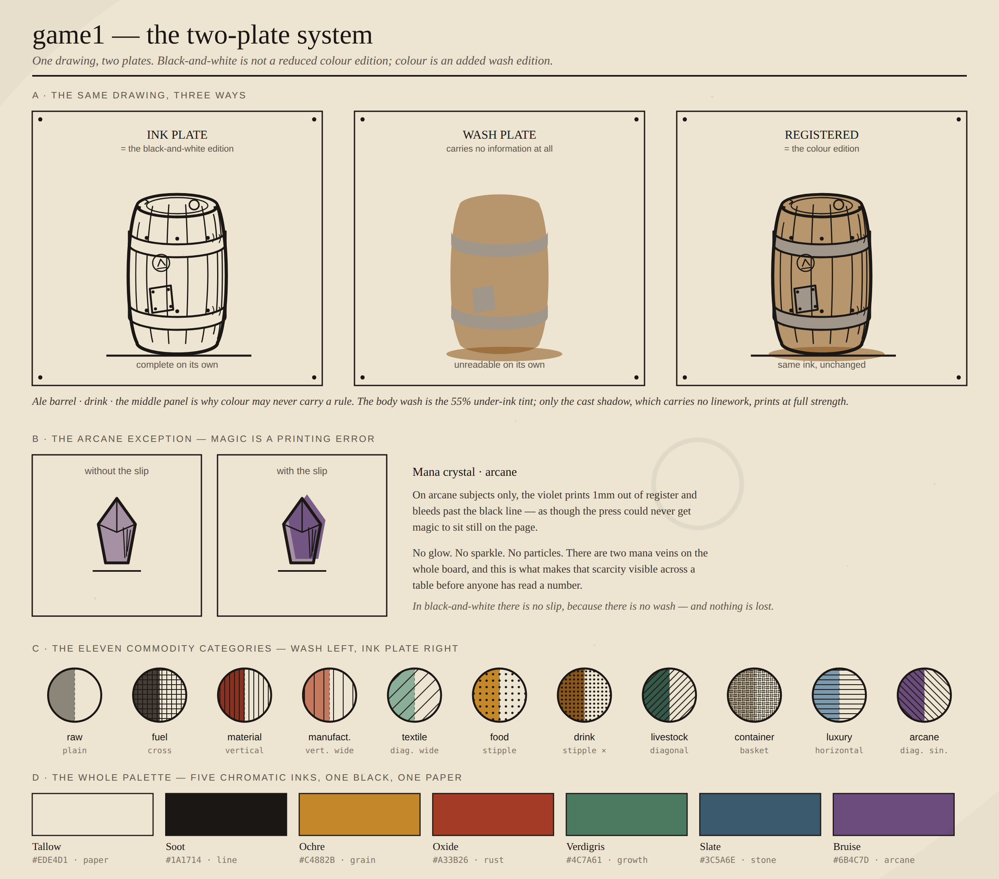
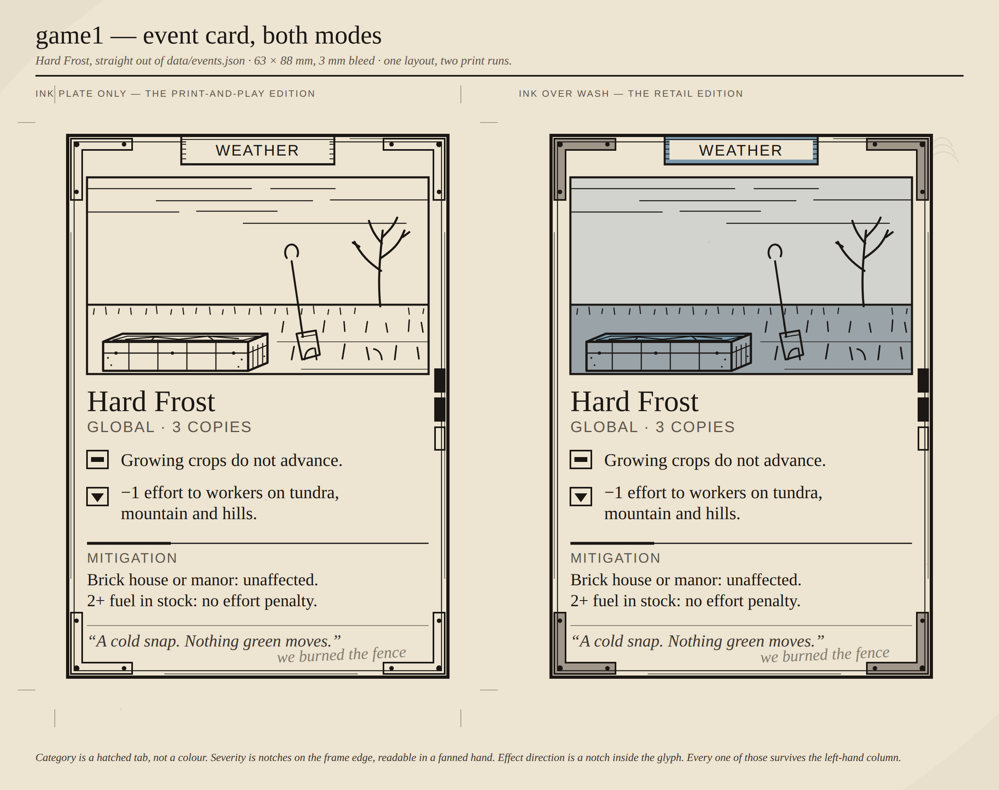

# Art and visual style

Visual direction for game1 — printed components, the web build, and anything a model
generates.

## The 60-second version

**Look:** a working settlement's trade almanac, printed on a tired press and carried in a
pocket for a season. The world is documented, not depicted. Heavy woodcut-style ink line,
hatching for shade, bare paper for light.

**Dirty · rustic · magical** — each owns a different layer:

- **Dirty** is on the paper and the press, never painted on the objects.
- **Rustic** is in the construction: timber, hammered iron, fired clay, rope, visible
  rivets and stitching. Worn from daily use and repaired, never ruined.
- **Magical** is a **printing error**. Arcane subjects — and only arcane subjects — print
  their colour out of register so it bleeds past the black line. No glows, no sparkles.

**The rule everything hangs on:**

> The **ink plate** carries all the information. The **wash plate** carries none.
> Black-and-white is the ink plate printed alone. Colour is the identical ink plate with
> the wash printed underneath.

Delete the colour. If a rule became unreadable, the ink plate is unfinished — fix the ink,
don't restore the colour.

**Palette:** five chromatic inks, one black, one paper. That is all of it.

| Soot | Tallow | Ochre | Oxide | Verdigris | Slate | Bruise |
|---|---|---|---|---|---|---|
| `#1A1714` | `#EDE4D1` | `#C4882B` | `#A33B26` | `#4C7A61` | `#3C5A6E` | `#6B4C7D` |

Bruise is rationed to arcane subjects only.

## See it



The same drawing three ways, the arcane slip, the eleven category hatches, and the whole
palette. [Source SVG](examples/01-two-plates.svg) ·
[black-and-white edition](examples/01-two-plates-mono.png)



A real card from `data/events.json` at print size, in both editions.
[Source SVG](examples/02-event-card.svg) ·
[black-and-white edition](examples/02-event-card-mono.png)

## The documents

| | |
|---|---|
| [00-art-direction.md](00-art-direction.md) | The conceit, the three words, tone, motifs, exclusions |
| [01-two-plate-system.md](01-two-plate-system.md) | **Read this one.** The two laws, the slip, the layer contract |
| [02-palette.md](02-palette.md) | The inks, the eleven categories, hatches, peoples, terrain, print spec |
| [03-line-and-texture.md](03-line-and-texture.md) | Silhouette, line weights, hatching, materials, wear, grime |
| [04-iconography.md](04-iconography.md) | Frames, size tiers, the commodity set, effort, effect glyphs |
| [05-typography.md](05-typography.md) | The flavour/rules split, the type stack, sizes |
| [06-components.md](06-components.md) | Cards, tiles, boards, tokens, print-and-play, the web build |
| [07-ai-agent-brief.md](07-ai-agent-brief.md) | **Generating art with a model — start here for that** |
| [08-influences-and-distance.md](08-influences-and-distance.md) | Where the influences stop |
| [palette.json](palette.json) | All of it as data |
| [framing.json](framing.json) | Where the subject sits on each accepted plate, for anything that crops one |

## Checking your work

```bash
node tools/validate-art.mjs                    # every example
node tools/validate-art.mjs path/to/asset.svg  # one file
```

It enforces the three things that are cheap to check and expensive to eyeball: every
colour is declared in `palette.json`, the ink plate is monochrome, and the layer contract
holds. It does not have an opinion about whether the drawing is any good.

## Cropping a plate

A plate is a whole drawn page. A card window is nearly square, an explorer thumbnail is
5:4, and neither is the shape of the page — so showing one means throwing part of it away,
and "the middle of the file" is the wrong part. It is what used to put a character's chin
at the top edge of their own card.

[`framing.json`](framing.json) says what may not be thrown away: a `subject` box per plate,
in fractions of the page, holding the head, the hands and the gear the card names.
[`docs/js/framing.js`](../js/framing.js) grows that box out to whatever shape the window
is — never shrinks it, unless the page itself runs out — and slides the result back onto
the page. The card builder and the explorer both run that one file, so a printed card and
a thumbnail of the same plate cannot disagree about where the subject is.

Drop a new plate in `renders/` and give it an entry in the same commit. Without one it is
framed on the middle of the page, and `build-cards.mjs` and `build-data.mjs` both say so.

## The one rule about the palette

`palette.json` is the source of truth, the same way `data/*.json` is for the rules. Prose
belongs in `note` fields; anything a program or an agent should act on belongs in a typed
field. If a colour is not in that file, it is not in the game.
