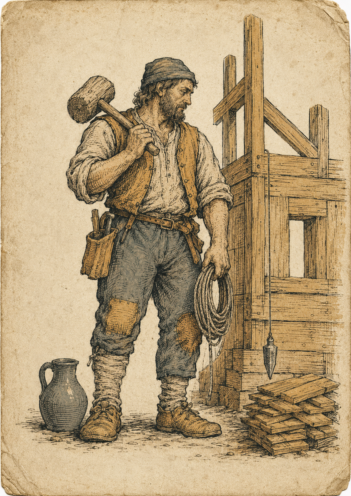
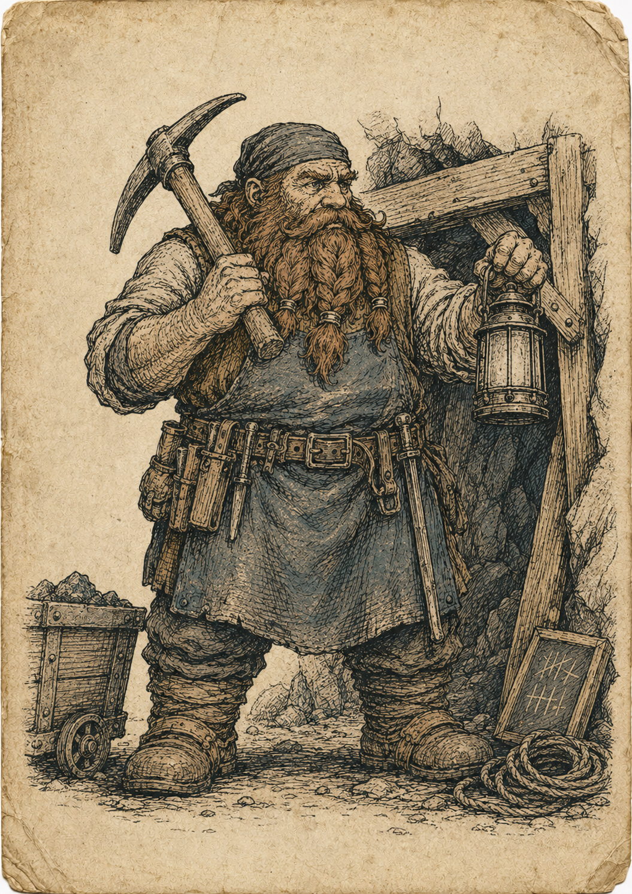
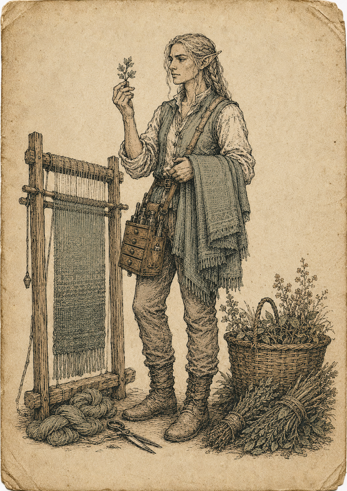
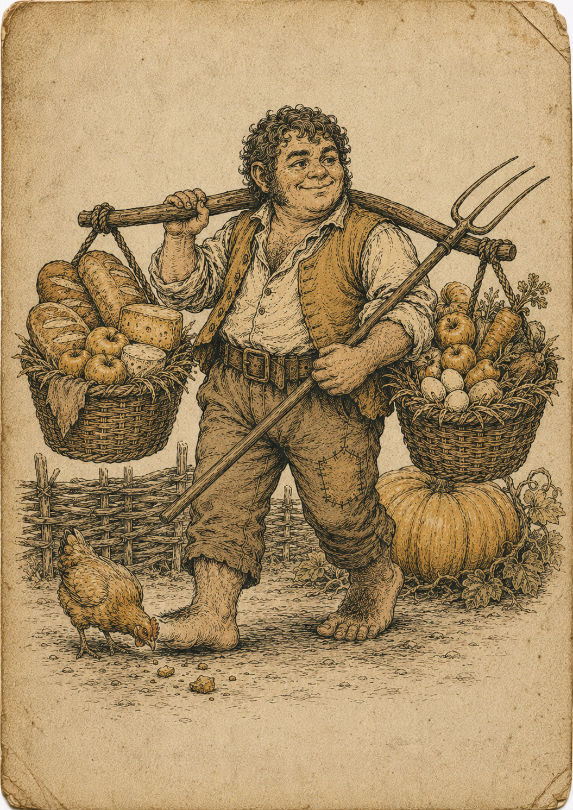

# 07 — Peoples, magic and conflict

## Peoples

Five, each with a distinct economic shape rather than a stat block.

| People | Die | Workers | The shape | The catch |
| --- | --- | --- | --- | --- |
| Humans | d6 | 2 | Cheap housing compounds into more workers than anyone | Never exceptional at anything |
| Dwarves | d6 | 2 | d8 underground, cheap smithing | −1 on any farm: they must buy food |
| Elves | d6 | 2 | Double foraging and herbs, 2 fine cloth for 1 | Near-useless underground; won't touch a mana vein |
| Halflings | d6 | 3 | Crops ripen a round faster, huts cost 1 log | 2 extra food per town, every round |
| Orcs | d8 | 2 | Enormous output, +1 die raiding | Double tool wear; can't build tier 3+ without capturing it |

The trade-offs are real: dwarves can't farm, elves can't mine, orcs can't refine,
halflings are always hungry, humans are never exceptional. The full trait list is in
the [annex](14-annex.md).

The folio plates show each people doing what their rules say they are good at —
the accepted renders from [`docs/art/prompts/peoples.md`](../art/prompts/peoples.md);
the orc plate is still to be drawn:

| | | | |
| --- | --- | --- | --- |
|  |  |  |  |
| *Humans — the builder* | *Dwarves — the miner* | *Elves — the weaver-forager* | *Halflings — the farmer* |

**Healers.** A new profession alongside the smiths and brewers: trained at the
**infirmary**, unlocked recipe *Tend the Sick*, and the difference between an illness
card being a story and being a body count. Physician, medic, witch doctor, bone-setter
— the title varies by people; the profession is the same, and the character deck
carries named examples of two of them.

## Magic

Deliberately small and economic rather than a second system bolted on.

**Mana crystals** come from mana veins — six per vein, difficulty 6 to survey, two
tokens on the whole board. They are the scarcest thing in the game.

**Arcane herbs** are foraged, which means a player with nothing but hands and a forest
has a route into the arcane economy. The ingredient list has grown three entries —
moon blossom (picked only at night), ember root (dug from dry ground) and frost
lichen (scraped off cold stone) — each with a potion that wants it.

**Potions** are brewed at an alchemist with an alembic, and they are one-shot effects on
the things the game actually cares about — hours, movement, safety:

| Potion | Effect |
| --- | --- |
| Draught of Vigour | One worker's die up two sizes for a round |
| Tireless Toil | Re-roll a worker's effort, keep the better |
| Brewmaster's Round | +1 effort to every worker in a town |
| Healing Draught | Cancel a worker loss, ignore a Plague card, or heal a character 3 |
| Swiftfoot | Double a figure's movement, or re-move a cargo |
| Stonehide | One unit ignores all hits in a battle |
| Prospector's Clarity | Auto-succeed a survey, reveal adjacent deposits |
| Merchant's Fortune | Shift a price band two steps for one sale |
| Owl's Eye | Travel tonight as if carrying a lantern |
| Physic Tonic | Cure one illness, anywhere |
| Emberguard Salve | Ignore every hit from a fire monster, one battle |

Every one of them buys hours, movement, safety or information. None of them break the
economy, and all of them are made of things the economy produces.

### The four elements

Every monster, every spell, every enchantment and every arcane fitting belongs to
one of four elements, and each one has a mark. The mark is **data** — one drawn
path per element in [`data/arcana.json`](../../data/arcana.json) — so a card, a
chit, this page and the explorer all say *fire* with the same four strokes, and
changing the mark changes all of them at once.

| Mark | Element | Ink | At home |
| --- | --- | --- | --- |
|  | **Fire** | oxide | Heat, forge-work, hunger. The desert and under the mountains. |
|  | **Earth** | verdigris | Stone, root, patience. Hills, barrows and old woods. |
|  | **Water** | slate | Current, mist, depth. Marsh, shore and open sea. |
|  | **Air** | soot | Wind, cold, distance. The tundra and the high passes. |

They are built on one construction, so they read as a set: a ground line, and
what the element does to it. Fire stands three tongues on it, earth puts a stone
on it and takes the ground down in strata, water replaces it with three swells,
air lifts three streamers clear of it altogether. None of them is a borrowed
alchemical triangle — [`04-iconography.md`](../art/04-iconography.md) bans
real-world symbols along with letterforms, and the triangles are the most
borrowed symbols there are.

**Mana and talismans.** Slaying a monster yields mana of its element — and mana must
be *held*. Elves carry up to 3 in the body; everyone else carries none, and stores it
in a **talisman**: six cards from a 2-capacity bone charm to a 10-capacity crystal
phylactery, each an item that is made, sold and stolen like any other. Mana is spent
on **spells** — fourteen now, listed in the
[annex](14-annex.md) — one cast per character per round. The whole system is defined
in `data/arcana.json` and reasoned through in [13-adventure.md](13-adventure.md).

## Conflict

**Combat.** Each side rolls a die per unit and hits on 4+. Weapons add dice; armour
cancels hits. Both sides apply hits at once, so attacking is never free. One round per
battle, with retreat allowed — the intent is a sharp exchange, not a wargame inside a
economy game.

**Strength and defence.** The 4+ is not fixed: shift it by **less your own strength, plus
their defence**. Strength 3 against defence 3 hits on 4+, strength 5 against defence 3 on
2+, strength 2 against defence 5 on 6+, and it never goes better than 2+ or worse than 6+.
Every figure in the game carries both — characters, monsters and the hirelings on the
inn's board — and they are printed in the card's summary strip and set on the player
board's **S** and **D** tracks.

Strength used to sit on *both* sides of that roll, which quietly made every strong thing
armoured for no better reason than that it hit hard. Splitting it lets a stone boar barely
swing and still turn a sword, a rime harpy be neither and be very easy to kill, and
Vhalrik be both, which is what the clamp is for. Defence is not armour: armour cancels
hits after they land, defence stops them landing, and a figure in plate has both.

Strength keeps its older job unchanged — the threshold some rules read off a monster card,
where a thug refuses anything of strength 4 or more — and it picked up a new one, since it
is also what a figure can carry (`strength × 3` kilograms). One arm, one number.

It is a *difference*, not a score, and it never adds dice. That keeps a battle one round
long however strong the people in it are, leaves +1 combat die meaning exactly what it
always meant, and lets one number on the board serve your whole side of the fight —
because the other side's is already printed on the card in front of you.

**Equipment.** A sword is +1 die. Steel doubles that and hits on 3+. A bow rolls before
the enemy does but needs arrows. A war hammer ignores armour entirely. Plate harness
absorbs three hits and costs you a move point.

Every weapon runs through the same production chains as everything else: a steel sword
is two steel and a leather, which is a mine, a smelter, a steelworks, a pasture and a
tannery. Arming yourself properly means having built an economy first, which is the
point.

**Raiding.** Players may attack each other's towns and cargo. The winner loots 25% of
the loser's stockpile (40% for orcs). Palisades give defenders an extra die; garrisoned
soldiers defend automatically; a watchtower cancels one raid per game.

**Why war is expensive.** Soldiers produce nothing and eat every round. A player who
builds an army has spent hours, food and housing on something that does not compound.
That should make war a considered choice against a specific rival at a specific moment,
and make the player who wars constantly lose on points to the one who farmed.

The event deck also brings unaligned enemies — raiders, wolves, a dragon — so a player
with no soldiers at all is taking a real risk rather than a safe one.

**Monsters.** The discovery tables bring twelve more, three per element, and meeting
one is a decision, not just a fight: slay it for its mana, or — where the card allows —
enslave it, befriend it with the gift it names, or domesticate it into the strangest
livestock you own. Not everything can be tamed, and the ones that cannot are the ones
the campaigns are built around. The deck and the option rules live in
`data/monsters.json`; the reasoning is in [13-adventure.md](13-adventure.md).

**Hired muscle.** Between a soldier's standing cost and a war's, there is the inn: thugs,
militiamen and hired blades escort one journey for a flat fee and eat nothing. They fight
at the strength and defence printed on the inn's board, and what you are paying for is
which of the two you get — the thug is strong and careless (4/2), the militiaman is
neither and is wearing a coat of plates (3/4), the blade is better at both (5/4). Costs in
`rules.json → hirelings`.
