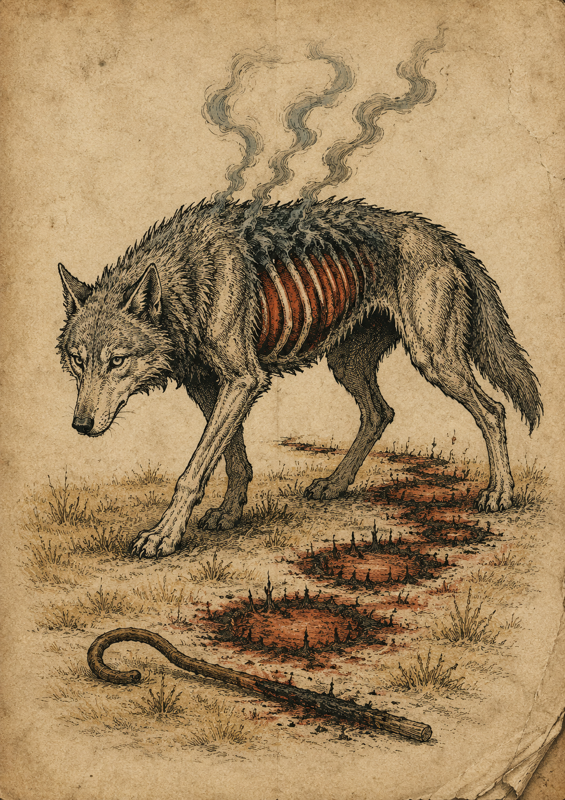
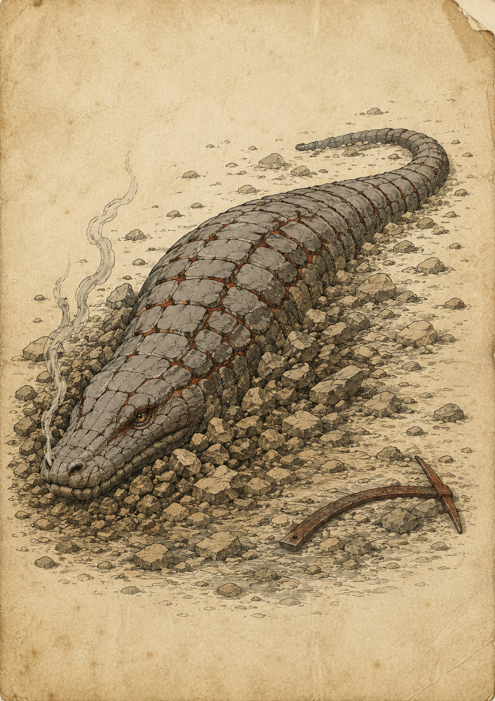
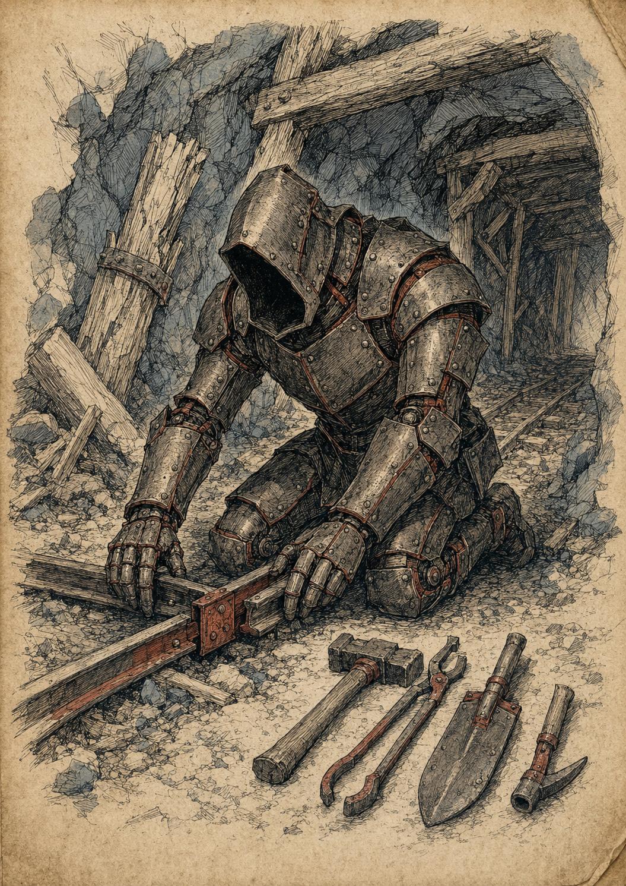
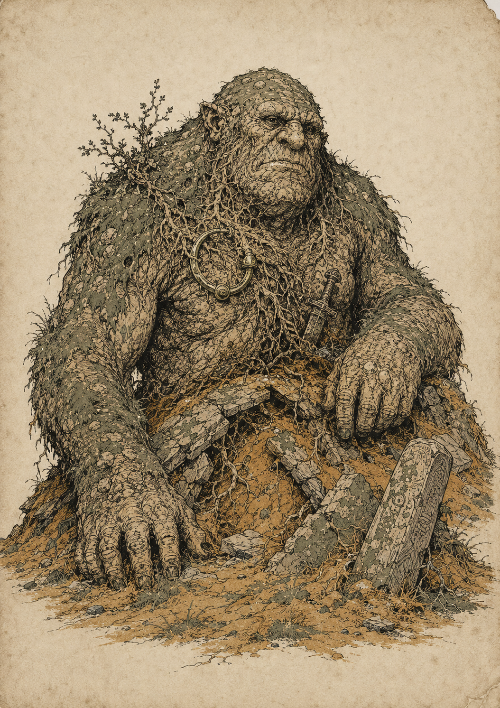
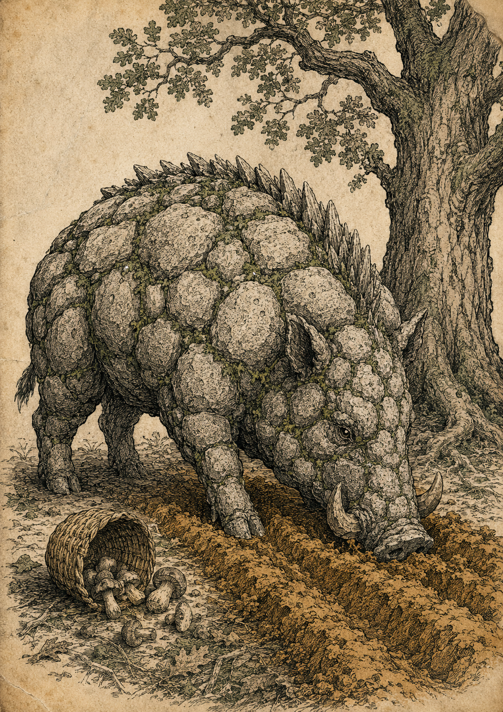
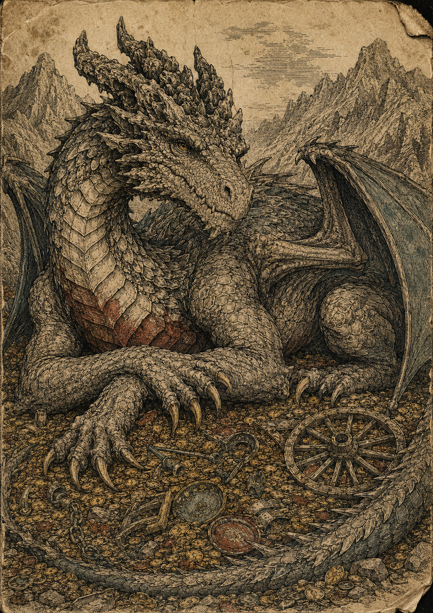
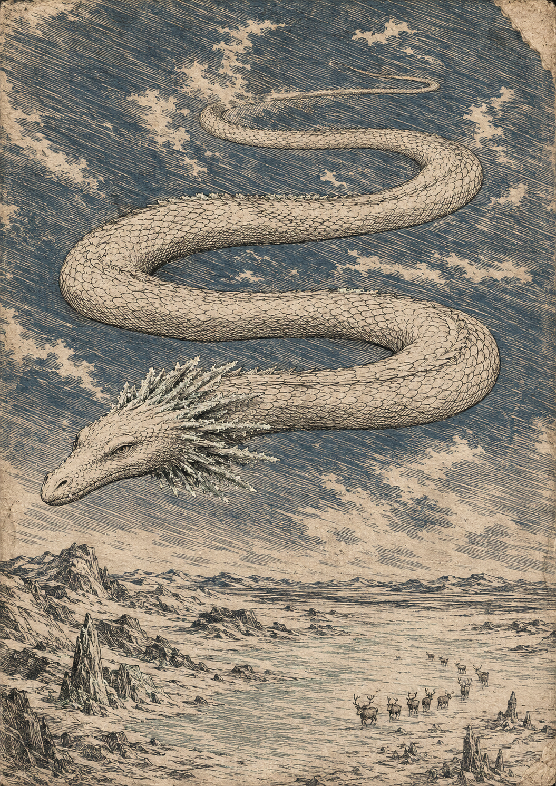

# 13 — The adventure layer

The game began as a settlement economy. It has grown an open world around it:
travel with day and night, discovery rolls, monsters, mana, quests and named
vehicles. The design intent is that the adventure layer **hangs off the economy
rather than floating beside it** — every sword is still a production chain, every
quest reward is still coin, goods or hours, and the fastest way across the map is
still the railway somebody had to build.

The data lives in five files, one system each: `travel.json`, `discovery.json`,
`monsters.json`, `quests.json`, `arcana.json` — with the decks in
`vehicles.json` and `characters.json` and the talismans in `items.json`. Prose
here, numbers there.

## Days, nights and light

Every moving figure, party or vehicle gets one **day leg** per round, at the
speed in `travel.json` for its mode and the terrain letter codes it crosses.
The letter in the bottom corner of every hex is the ruling: G4 means a walker
crosses four grassland hexes in a day.

After the day leg a party may push on into a **night leg** — but the dark in the
Reach is genuinely dark:

| Light | Night speed |
| --- | --- |
| None | No travel. Even on a road. |
| Torch | 1 hex (2 on a road); **1 wear**, which is the whole of a torch |
| Lantern | Half day speed, rounded up; 1 wear of its eight |
| Owl's Eye potion | As a lantern, for one round |

A night leg is never free: it triggers a second discovery roll where the party
stops, with the monster band widened by 1. Trains run at night at full speed
with a lantern fitted; ships need one rigged and sail at half speed. Torches
burn out; lanterns are capital — and that is now the wear track saying it rather
than a special rule about torches. A torch has **1 wear** and a lantern **8**: the
same number in the same box on the same ladder, and the whole economy of light
falls out of the difference. It makes a lantern one of the best-value items in the
game, which is why one is a quest delivery.

**A night leg also halves the number that lets you leave.** Pace under a lantern is
half your day speed rounded up, and under a torch it is 1 — so pushing on past dark
is the cheapest way in the game to make yourself catchable. See *Running away*,
below.

**Caves** appear through discovery rolls on hills and mountains (the `caves`
terrain feature). A party may enter only with a lit torch or lantern; inside is
one draw on the cave column — hazard, trace, monster, or hoard. An emptied cave
becomes a known camp: resting there is free.

## Discovery rolls

When a figure, party or vehicle **ends** a movement leg, it rolls a d20 on the
discovery table for the hex it stopped in — one roll per leg, never one per hex
crossed. A road or rail on the hex overrides its terrain table.

The tables (in `discovery.json`, printed in the annex) are skewed on purpose:

- **Roads** grow merchants, travellers and bandits; monsters mostly keep clear.
- **Rail** rolls only at the stops — and never yields a commodity trace, because
  the ground either side of the line was picked clean while it was laid. Fewer
  stops, fewer rolls: the train is quietly the safest way across the map, and
  that is intended.
- **Desert, mountain, marsh** are monster country, exactly as the fiction says.
- **Commodity traces are rare everywhere.** Discovery is what you find when you
  are *not* looking. Prospecting, foraging and hunting are jobs with their own
  recipes and roll tables, and a discovery roll never replaces a survey — it
  just tells you where surveying might pay.

Any result that persists — a monster, a trace, a cave, a quest site — is marked
on the hex with a tile or figure, so the whole table can see the world filling
in as it is walked.

Event cards can move the odds: **Blood Moon** widens every monster band by 3,
**The Quiet Season** shrinks it by 2, and within one hex of a settlement the
band always shrinks by 2 — the land there is walked, hunted and lit. Bands
widen downward from their printed bottom and never claim 1 or 20.

## Monsters

Fourteen — three of each element, fire, earth, water and air, and then the two
dragons the sighting cards had been promising — in `monsters.json`, drawn when a
discovery roll says **monster** and the drawn card's terrain list includes the
hex. Water monsters do not occur in the desert because the deck itself refuses
the draw.

Every one of them prints five numbers and a mark in its summary strip — **H**
health, **S** strength, **A** armour, **P** pace, **Y** mana yield, and its
element — and every one of those five is a number a *player* can also have. That
is what lets a monster be dealt onto a spare player board and run like anybody
else at the table: there is nothing on the card the board cannot hold.

Meeting one is a choice, and the choice is the player's unless the card says
otherwise:

| Option | How | What you get |
| --- | --- | --- |
| **Slay** | Fight, per the conflict rules: totals, difference, health off the loser | Mana in its element — **the lesser of the Y box and a roll of the purple die** |
| **Enslave** | Beat it by **2 or more** without taking it to 0 health — declared before you roll | A d4 worker that eats and breeds unrest. No mana |
| **Befriend** | The gift on its card, then 4+ on a d6 | A guard for a hex, or an escort. No mana |
| **Domesticate** | Befriend or win without killing, then 2 rounds at a pasture | The benefit on its card. No mana |
| **Flee** | **Only if your pace is greater than its P.** Withdraw the way you came | Nothing, nothing looted, and no discovery roll this leg |

Three of those rows changed shape when the battle roll did, and the changes are
not cosmetic. **Enslave** used to be *win by 2+ net hits*, and there are no hits
to net: it is a margin on the one total now, declared before the dice so that
taking a monster alive is a risk you accepted rather than a mercy you discovered
afterwards. **Slay** pays a die rather than a price list — the Y box is a ceiling
and the purple die says how much of it you caught. And **Flee** stopped being
free, which is the largest of the three and has a section of its own below.

Not everything can be tamed: the card lists which options it allows, and the
Gravel Wyrm, the Mire Strangler, the Dust Devil and the Deepwater Maw allow none
of them. The trade is deliberate — slaying pays mana, the other three turn mana
away for a living asset that eats.

All fourteen bestiary plates are accepted
([`docs/art/prompts/monsters.md`](../art/prompts/monsters.md) is the brief):

| | | | |
| --- | --- | --- | --- |
|  |  |  |  |
| *Cinder Wolf (MON-01)* | *Ash Drake (MON-02)* | *Forge Wight (MON-03)* | *Barrow Troll (MON-04)* |
|  |  |  |  |
| *Stone Boar (MON-05)* | *Gravel Wyrm (MON-06)* | *Mire Strangler (MON-07)* | *Reef Serpent (MON-08)* |
|  |  |  |  |
| *The Deepwater Maw (MON-09)* | *Rime Harpy (MON-10)* | *Dust Devil (MON-11)* | *Storm Roc (MON-12)* |
|  |  | | |
| *Vhalrik, the Cinder-Crowned (MON-13)* | *The Hoarwyrm (MON-14)* | | |

An unresolved monster stays on its hex as a figure and attacks whoever ends a
leg there. The wild accumulates.

### Running away

**A party may run only if its pace is GREATER than the monster's.** Equal is not
greater: a thing that matches you stays with you, and there is no roll to make it
otherwise. A party that cannot outpace what it has met **may not decline the
fight** — the option is not offered. It may still befriend it, or offer it
something, or die.

Fleeing used to be free. Withdraw the way you came, lose the discovery roll,
done — and the cost of that was the whole bestiary. Every monster was optional,
which made most of them decorative: a card turned over, a shrug, a leg ended one
hex short. A deck of fourteen creatures nobody ever had to fight is a deck of
fourteen illustrations.

So the P box went on every card, and the comparison is a footrace:

| Your leg | Pace | Gets away from |
| --- | --- | --- |
| On foot, mountain or marsh | 1 | **Nothing at all** — a mire strangler is pace 1, and equal is not greater |
| On foot, forest, hills, tundra or desert | 2 | The mire strangler |
| On foot, grassland | 4 | Everything up to the barrow troll — but not the stone boar at 4 |
| On foot, on a road | 5 | Up to the maw and the hoarwyrm; the reef serpent matches you |
| Mounted, grassland | 6 | Up to Vhalrik and the reef serpent; the wolf and the drake match you, and the harpy, the dust devil and the roc are faster |
| Mounted, on a road | 8 | Everything except the storm roc — **which nothing in the game outruns** |

Read down that column and the design falls out of it. On foot in grassland — the
best ground a walking party gets — you outrun the barrow troll and nothing else
that lives there. On foot in the mountains you outrun nothing whatsoever, and the
mountains hold seven of the fourteen. The three fastest creatures in the deck are
all air monsters, and two of them keep to the high passes and the tundra, which
is precisely where nobody keeps a horse. And the storm roc is pace 8, the fastest
leg anybody can make is 8, and equal is not greater — so the roc is the one
creature in this game nobody has ever walked away from.

**This is the change that puts a road, a horse and a night's sleep into the same
decision as a sword**, and each of the three gets there by a different door.

The **road** and the **horse** are the obvious two: they are pace, directly, and
they were already being bought for the toll and the haulage. A mounted party on a
road outruns thirteen of the fourteen and can be a coward all day; a party on foot
in the mountains has bought nothing but the fight it is standing in. The
infrastructure the economy game was building for money now decides whether the
adventure layer is survivable, which is exactly the join this whole layer is
supposed to have.

The **night** gets there by the back. Pushing on into a night leg is the standing
temptation of the travel rules — one more round of distance, for the price of a
lantern — and what it actually costs is now legible in one number: **a night leg
under a lantern is half your day pace, rounded up.** So the party that refuses to
make camp halves the only figure that lets it decline a fight, and does it on the
one leg that rolls a *second* discovery with the monster band widened by 1. Push
on and you are slower, in the dark, rolling more often, on a worse table. Sleep,
and every one of those goes the other way. That is the sentence the flee rule was
missing: a night's camp used to be about health and strength, and now it is about
whether you get to leave.

And it means plate harness costs you something real: **−1 pace** as well as +3
armour. The best armour in the game is also the reason you have to use it.

One exception, and it is aimed at exactly the situation it sounds like: monsters
of **strength 4 or more get one free round of the battle roll against a fleeing
cargo vehicle**, whatever its pace. A loaded wagon does not sprint, and a big
enough thing gets its one swing at it as it goes. Full rules in
`rules.json → conflict.flee`.

## Mana, talismans and spells

Slaying a monster yields **mana**, element-matched — and how much is a die, not a
price. The **Y** box on the card is the *most* the corpse can give up; what you
actually take is **the lesser of that number and one roll of the purple mana die**
(`arcana.json → manaDie`), rolled once at the moment it reaches 0 health and split
among whoever fought.

It was a payment until it was a ceiling, and the reason for the change is
Vhalrik. Six mana, every time, known in advance: the largest fight on the map was
an errand with a price sticker on it, and no decision in it survived the moment
you did the arithmetic. Now the small kill is wages and the great kill is a
gamble. A cinder wolf yields 1, so any roll but a 1 is still 1 and the trickle at
the bottom of the deck is untouched; Vhalrik yields 6, so the die is the whole
story and half the time you leave four of it lying on the mountain. The purple die
is the fifth and last die in the box — blue is what you want, red is what stands
in your way, green is the weather on a market, ochre is what the season takes back,
and bruise is what a dead monster gives up. Five inks, five dice, no sixth.

Mana is not a commodity: no bulk, no stockpile, no crate. It must be *held* — and
almost nobody can hold
it in the body. Elves carry up to 3 innately; humans, dwarves, halflings and
orcs carry none at all. Everyone else's mana lives in a **talisman**
(`items.json`, class `talisman`): a bone charm holds 2, a copper amulet 4, a
crystal phylactery 10. Talismans are items — made, bought from merchants, sold,
and stolen with everything that implies. The card prints the capacity in the
**M** box of its summary strip; the charge is walked on the player board's M
track, like every other number that moves.

All six talisman studies are accepted — the only deck that gets the violet, and
the violet is a printing error, exactly as
[`docs/art/prompts/talismans.md`](../art/prompts/talismans.md) demands:

| | | |
| --- | --- | --- |
|  |  |  |
| *Bone Charm (TAL-01) — holds 2* | *Weaver's Knot (TAL-02) — holds 3* | *Copper Amulet (TAL-03) — holds 4* |
|  |  |  |
| *Gold Locket (TAL-04) — holds 6* | *Gemfire Pendant (TAL-05) — holds 8* | *Crystal Phylactery (TAL-06) — holds 10* |

Mana is spent on **spells** (`arcana.json`): fourteen of them, at least three per
element, running from a 1-mana Kindle to a 5-mana Stormcall. Like the potions,
every one buys the things the game actually cares about — hours, movement, safety,
repair, information — and none of them break the economy. Casting is one spell per
character per round, and only characters cast.

Mana crystals (the commodity) are frozen mana: shatter one for 2 mana of any
element, but mana never freezes back.

## Merchants, inns and hired muscle

**Merchants** are met on the road (a discovery result) or visited in any
settlement. Either way: shuffle the item deck and deal cards face up per
`rules.json → market.merchantStock` — 2 for a roadside pedlar, 3 in a village,
5 in a town, 7 in a city, 9 at the Seat. That is the stock, this visit, at base
value +10%. A bigger place is genuinely a better place to shop, and a roadside
merchant with exactly the lantern you need is a small story the dice wrote.

**Inns** do four jobs, and every printed settlement has one:

- **Rest** — 2 health per round (3 with a healer in town), 5 coin, free at home.
- **Hirelings** — a thug (20/journey), a militiaman (35) or a hired blade (60)
  escorts one journey or one cargo. They eat nothing; the fee is everything. A
  thug will not face a monster of strength 4+.
- **Rumours** — pay 5 coin, draw a quest card, accept or decline.
- **Drinks** — the old job: serve ale to clear unrest, per the recipe.

## Illness and healers

Illness arrived in the event deck: **Camp Fever** hits a travelling party,
**Marsh Ague** hits a region, **The Grey Pox** hits every town of four or more
workers, and the old **Plague** still stalks regions. The counters, in order of
cost: a **Healing Draught** or **Physic Tonic** spent (potions), a **healer**
specialist trained at the **infirmary** (a town with a fed healer loses no
worker to any illness card), and Doctor Marrow or Tilly Goodbarrel in the
character deck, who each ignore parts of it outright.

The pattern matches the rest of the deck: every illness card has a mitigation
you could have bought in advance, and the infirmary is the building whose
absence you get to regret by name.

## Quests and campaigns

The quest deck (`quests.json`) is the choose-your-own layer: cards that arrive
through discovery **omens** or inn rumours, are read aloud, and are **accepted
or declined** on the spot. Declined cards go to the bottom for someone else.

They run a deliberate range of complexity, 1 to 5: from *deliver 3 grain to
Grist* (an errand with a wage) through *slay the thing behind Umber Hollow's
missing-persons ledger*, up to two staged **campaigns** — the Ironspine Road,
which ends with cheap rail through the pass for whoever proved it, and the
Drowned Bell of Taleowick, which ends with the Deepwater Maw. Campaign stages
complete in order and pay per stage.

This is the part of the game designed to grow fattest over time. New quests are
new cards; a new map brings its own; nothing else has to change.

## Vehicles and characters

Two more decks give the moving pieces names:

**Vehicles** (`vehicles.json`) — twelve named machines, three each of train,
ship, caravan and horse. A card is a specific vehicle with a story and a quirk:
the Reach Flyer is fast and takes passengers, Old Smoke is cheap and limps, the
Fenway Wagons cross marsh that stops everything else on wheels. Each card
prints two boxes in its summary strip — **H** for the hull, **C** for the bulk of
its hold. A vehicle in play is dealt a **player board of its own** and run like a
player who is not a person: its card in the recess, its cargo and modifications in
the four kit slots, and its hull on that board's health track. At nothing it is
wrecked — it spills its cargo on the hex, and salvage is whoever reaches it first.

Eleven of the twelve catalogue plates are accepted
([`docs/art/prompts/vehicles.md`](../art/prompts/vehicles.md)); the Varl
Wagonrow (VEH-09) is still to be drawn:

| | | |
| --- | --- | --- |
|  |  |  |
| *The Reach Flyer (VEH-01)* | *Steppe Hauler (VEH-02)* | *Old Smoke (VEH-03)* |
|  |  |  |
| *Gullwing (VEH-04)* | *Saltreach Pride (VEH-05)* | *Ember Coast Trader (VEH-06)* |
|  |  |  |
| *The Dunhaven Column (VEH-07)* | *The Fenway Wagons (VEH-08)* | *Bay Courser (VEH-10)* |
|  |  | |
| *Steppe Pony (VEH-11)* | *Black Malchior (VEH-12)* | |

**Characters** (`characters.json`) — eight named adventurers; each player's hero
figure takes one at setup for a face and a **summary strip** across the top of
the card, which is every number they have, printed once:

| H | S | M | ¤ | KG |
| --- | --- | --- | --- | --- |
| health | strength | mana held in the body | coin at setup | what they can shoulder |

Those are the player board's own track letters, so setting up is reading across
the strip and putting tokens down left to right. Nothing on the card moves —
there is no bar on any card any more — and the portrait gets the full width of
the card because there is nothing beside it.

**The strip lost a box.** There was a **D** between S and M and there is not any
more, because defence went with the to-hit roll it existed to shift. What a
character brings to a battle besides their strength is the gear in their four kit
slots, and gear is a card with its own number on it — so the thing that used to
be printed on the hero is now something the hero is *carrying*, which is both
truer and one fewer number to reprint every time the fight changes.

### Strength — one arm, one number

Every item in `items.json` carries a **mass in kilograms**, and strength is the
other half of that arithmetic. There is no burden number and no burden track:
what a character can shoulder is **strength × 3 kilograms**, printed in the KG
box so nobody multiplies at the table and derived so it can never disagree with
the strength beside it. Ruk of the Red Road is strength 6 and carries 18 kg, the
most of anyone; Old Mother Keswick is strength 2 and carries 6. A tunic is half a
kilogram, a sword three-quarters, a plate harness 12.5 — which is to say plate is
for figures of strength 5 and up, and always was.

Nothing is walked for it. Total what the character is wearing, wielding and
stowing, and it either fits under the printed limit or it does not: load the rest
onto a vehicle, hand it to someone with room, or leave it where it lies. A
character carried to a settlement at 0 health loses the lot on the way.

Burden and strength were the same arm doing the same job under two numbers, and
one of them was a track a player moved every time they picked up a rope.

**Mass is not bulk.** Bulk is a commodity's storage-slot and shipping cost and
belongs to the cart; mass is what a thing weighs and belongs to whoever is
holding it. They never convert into each other, and nothing in the data has
both. Full rules in `rules.json → carrying`; the whole item table with masses is
in the [annex](14-annex.md#items).

### Armour — the only thing between you and the blow

A battle is one opposed total: your strength plus your gear plus two blue dice
against its strength plus its armour plus two red, and the lower total loses
health equal to the difference. **Armour is a number you add to your own side of
that**, once per piece worn, and it is the whole of what stands between a figure
and a wound. A worn suit runs 1 to 3; a figure wearing body, head and off-hand can
reach 5; monsters run 0 to 3 and print theirs in the **A** box.

This section used to be called *Defence — what makes a blow miss*, and there used
to be two numbers in it. Defence stopped a hit landing; armour cancelled it once
it had; a figure in plate had both. That was an honest distinction while there was
a to-hit roll to distinguish — one number moved the target, the other ate the
result — and it is the reason every character and every monster in this game
carried two defensive ratings for as long as they did.

There is no to-hit roll. And with nothing to hit, **a number that makes you harder
to hit and a number that soaks the hit are arithmetically the same number** —
both are an amount by which the other side's dice fail to hurt you, and the only
difference left was which side of the roll you subtracted it on. So defence was
deleted and armour absorbed it: a monster's defence was halved and reprinted as
its **A**, a character's went off the summary strip entirely, and peoples stopped
having a `defence.base` because armour is a thing you buy rather than a thing you
are born with. A stone boar barely swings and still turns a sword — strength 2,
armour 2 — and it says that in two numbers meaning two things, where the old pair
said it in two numbers meaning one.

What that cost is a shade of character: a duellist and a knight are the same
column now. What it bought is the whole of the deletion — one field, one direction,
one place to look — and the agility went somewhere it does more work, which is
**pace**, and whether you are in the fight at all.

Armour wears. One wear point per round of battle on every piece worn, both sides,
win or lose, because a blow you turned still dented the plate.

### Wear — everything a figure carries is running out

**Tools wore out and nothing else did.** A sword was immortal, a suit of plate
never dented, a rope never frayed and a lantern burned forever — so the only
equipment decision anybody made twice in a whole game was which axe to buy.
Everything a figure carries wears now, on one scale, in one unit, at **one wear
point a use**:

| The thing | What counts as a use |
| --- | --- |
| A tool | Each **job** it is used in — not each hour |
| A weapon, shield, helm or suit | Each round of a battle it is swung or worn in |
| A light | Each night leg it is burned on |
| Anything else | What its own card says: a rope that takes a party down a cliff, a bag stuffed past its seams |

The maximum is printed once, in the **W** box of the card's summary strip, and it
is walked on the board — four narrow **W** ladders, one against each kit recess,
so a player tracks the wear of the four things they are actually carrying and
nothing else. At 0 the thing is finished: the card is discarded, the ladder is
cleared, and whatever it was doing for its owner it stops doing at once. A sword
that goes at 0 mid-battle leaves you swinging with nothing for the rest of it, and
a tool that breaks does not refund the job it broke on. A blacksmith mends three
rungs a round at four coin a rung; what cannot be mended is a thing at 0, which is
not damaged, it is gone.

**The numbers came down to meet the board, not the other way round.** Wear used to
run to thirty-four and be counted on the tool itself, because there was no track
for it and the note beside the strip said there never would be — *it runs past
twenty, the board stops at fourteen.* Now there is a track, so the scale is the
board's. Tools that ran 14 to 34 run **6 to 14**: the alembic is the frailest at 6
and a large loom the longest-lived thing anybody owns at 14, which is the ceiling
exactly. What a figure carries on its back sits under that — a torch is 1 and gone
in a night, a plate harness 12 — and all of it walks the same 0–14 ladder as
everything else in the game.

Nothing got shorter, because **the clock changed with the scale.** An axe had 24
wear at one point per labour *hour*, which is eight three-hour jobs. It has 10 at
one point per **job**, which is ten. The axe lasts slightly longer than it did and
nobody adds hours up at the table any more. That is the identical trade the
kilogram made when a hero could not stand their own load on a fourteen-rung
ladder, and it is the right way round: the ceiling belongs to the game, and a
number that will not fit under it is a number that is wrong.

Three things never wear. **Potions** are drunk rather than worn out, so the card
is discarded on use and there is no W box on it. **Talismans** do not, because
mana is not friction — a phylactery filled and emptied a hundred times is a
phylactery. And **commodities** do not, because they are counted rather than owned.

### Eating and sleeping

Two kinds of hurt, mended two different ways, and the split is what makes a
night's camp a decision rather than a formality:

- **A round that ends with a figure unfed costs 1 health.** Every round it goes
  on. Being fed again does not put it back.
- **A night without a camp costs 1 strength** — travel a night leg, or push on
  past dark, and every figure in the party loses a point. Two hard nights turn a
  caravan guard into a passenger.
- **One night's sleep restores strength in full**, wherever it is taken: a camp
  on open ground does it as well as a bed at an inn.
- **Sleeping mends no health at all.** Health comes back only under medical aid —
  a healer, an infirmary, a physician standing there, or a potion.

That is why a lantern, a granary, an inn, a stretch of salted meat and Doctor
Elspeth Marrow are all worth their coin, and why the shorter leg with a camp at
the end of it often beats the longer one without.

All eight character plates are accepted
([`docs/art/prompts/characters.md`](../art/prompts/characters.md)):

| | | | |
| --- | --- | --- | --- |
|  |  |  |  |
| *Corin Vale (CHR-01)* | *Berga Understone (CHR-02)* | *Sylvae of the Duskmere (CHR-03)* | *Tilly Goodbarrel (CHR-04)* |
|  |  |  |  |
| *Ruk of the Red Road (CHR-05)* | *Doctor Elspeth Marrow (CHR-06)* | *Havik Coalbrand (CHR-07)* | *Old Mother Keswick (CHR-08)* |

**Card codes.** Every card carries a deck prefix and sequence — `VEH-03`,
`MON-09`, `QST-07`, `TAL-06`, `CHR-01` — with a `v2` suffix if a card is ever
reprinted changed. The scheme is defined in `vehicles.json → cardIdScheme`. The
code is print identity, not data identity: the `id` field is the identity, and
anyone forking the game is free to renumber.

**Card fronts.** `tools/build-cards.mjs` renders the fronts for these four
decks — characters, vehicles, monsters and talismans — from `data/*.json` and
the accepted plates, into [`docs/cards/`](../cards/index.html), to the two-plate
layer contract. Only a card whose plate has been accepted is rendered; edit the
data or the renders, re-run the tool, and never the SVGs.

Each deck's portrait window is the shape of that deck's plates, as tall as its
wordiest card leaves room for, and what fills it is a crop taken around the
plate's subject from [`docs/art/framing.json`](../art/framing.json) — a card
shows a character's face and hands, not the middle of the page they were drawn
on. The explorer's deck thumbnails crop through the same code.

**Printing them.** [`docs/cards/print.html`](../cards/print.html) collates any
selection of these cards onto A4 or US Letter at a true 63 × 88 mm — nine to a
sheet of A4 — each with a dotted line on its trim to cut along and its 3 mm of
bleed held outside that line. A cut card is the size of a standard playing card,
which is the point: it glues onto one and shuffles with the rest of the deck.

## Mini-maps

Some moments need more board than a single hex: a battle, a boarding action, a
farm becoming a village becoming a walled town. These resolve on **mini-maps** —
A4 landscape sheets, each dominated by one large hexagon subdivided into small
hexes, representing the inside of a single cell of the campaign map.

Three series, specified in [`docs/minimaps/`](../minimaps/README.md):

- **Holdings** — four blank settlement sheets, one per player, kept in front of
  you for as long as your farm, village or town stands on the big map.
- **Grounds** — one battle sheet per land terrain plus the shallows, pulled out
  when an encounter needs positioning and put away when it is done.
- **Places** — one sheet per named settlement on the Korvane Reach, used when
  play goes inside Vossgard or Dunhaven or Fen's End.

The side panels either side of the hexagon are working space: the **left panel
is the encounter tracker** (initiative, round, morale), the **right panel is the
holdings ledger** (buildings, garrison, stores). A battle sheet uses the left;
a settlement sheet mostly the right; both are printed on every sheet so no sheet
is ever the wrong sheet.

All thirty-two sheet artworks are accepted and live in
[`docs/minimaps/img/`](../minimaps/img/) — one of each series:

| | | |
| --- | --- | --- |
|  |  |  |
| *Holdings: The River Meadow (PSM-01)* | *Grounds: marsh (TBM-05)* | *Places: Vossgard (SET-01)* |

## The player board

The adventure layer arrived one card at a time — a health bar here, a burden bar
there, a mana bar inboard of that one — and every bar was on an edge, which is
the right place for a card you are holding and the wrong place for one lying on
the table. The [player board](08-components.md#the-player-board) is where they
all ended up, and taking them off the cards is what gave the portraits the full
width of the card.

One A4 landscape sheet each and every one identical, printed at
[`docs/boards/`](../boards/index.html). The card in play drops into a recess top
left, four more recesses take whatever that card has in play, the round's phases
print underneath, **four** numbered tracks run up the middle, and a narrow wear
ladder stands against each of the four kit recesses:

| | Track | A rung is | Runs | Walked by |
| --- | --- | --- | --- | --- |
| **H** | Health | 1 | 0–14 | The figure, hurt and mended — medical aid only |
| **S** | Strength | 1 | 0–14 | Set from the card; a rung down for every night without a camp |
| **P** | Pace | 1 hex | 0–14 | Hexes left in this leg — and what you must beat to run from a monster |
| **M** | Mana | 1 | 0–14 | The body and every talisman in a slot |
| **W** ×4 | Wear | 1 | 0–14 | One ladder per kit slot, set from the card's W box, down a rung a use |

The ladders are numbered from the bottom and walked by a token, and they are
numbered and **nothing else** — no rung glyph, no plus, no minus. A little mark
saying which *kind* of number this is was competing with the figure for the same
three millimetres. Which way a token walks is a sentence in the rulebook, where
there is room to say it.

**The board traded a column for four ladders and came out wider.** The **D**
column went out of the middle the same day wear arrived at the edge, so what used
to be five columns at a shade over 13.6 mm is four at **15.6** — the tracks a
player reads every round are now noticeably easier to read than they were before
anything was added. Margins came down from 8 mm to 6 and gutters from 6 to 4 to
pay for the rest of it.

Wear is drawn at the edge rather than up the middle because it is **the first
number on this board that belongs to a card rather than to whoever is sitting
behind it.** A single W column could only ever have counted one thing's wear, and
a figure carries four — so it is drawn where the thing it counts is lying, in a
ladder against the recess, walked by a 4.5 mm **pip** rather than the 7 mm bar the
main tracks use. That is what makes fifteen rungs fit down the side of an 88 mm
card. And a fifth thing in play is a fifth thing whose wear nobody is counting,
which is the argument the four kit slots were already making.

**Pace is the board's own**, and it is the one that was missing. A party looks
its day-leg speed up in [`travel.json`](../../data/travel.json) every single
round of the game and has never had anywhere to keep it: set the token at the
start of a leg, walk it down a rung per hex entered, halve it for a night leg
under a lantern. At zero the leg is over, and the discovery roll happens
wherever it stopped. It is pace rather than speed because strength has the S.

It is also, now, the number the other side of the table is measured against. Every
monster card prints a **P**, and a party may run only if its own pace is *greater*
than that one — so the token a player has been walking down all leg for
bookkeeping reasons turns out, the moment something steps out of the trees, to be
the number that says whether they are allowed to leave.

**A vehicle gets a board too.** It used to get a column — a sixth track called V,
counting damage on a wagon most players were not running, printed on everybody's
sheet. A vehicle in play is dealt one of these boards instead and run like a
player who is not a person, exactly as a monster met on the road is: its card in
the recess, its cargo and its modifications in the four kit slots, and its
**hull on the health track**, set from the printed H, down as it is damaged, up
as it is repaired at 5 coin a rung in any town, wrecked at nothing and spilling
its cargo on the hex. A hull is a body, and the board never had to learn anything
new to run one.

**Strength and pace are the pair that changed the game rather than recording it.**
Strength was already printed on every monster card as a threat rating; it is now
the base of your whole side of a battle, it swallowed burden on the way past —
what a figure carries is strength × 3 kilograms and there is no second track for
it — and it is still the threshold rules read off a monster card, where a thug
refuses anything of strength 4 or more. One arm, one number, three jobs, and a
hard night takes a rung off all three at once.

**Pace** is the newer half, and it is the one that turned a track into a decision.
Made a footrace, it stopped being a record of the leg and became the price of
declining a fight — which is why a road and a horse are now weapons, why plate
harness charges you a point of it, and why the column that used to be pure
bookkeeping is the one a party now argues over.

*Defence used to be the other half of this heading*, and it is worth saying what it
was doing: it shifted a to-hit roll by *less your own strength, plus their
defence*, so an even fight hit on 4+ and a point of advantage was worth exactly one
pip. It went when the to-hit roll went, and what replaced it is armour, which was
already in the game doing the other half of the same job. The full rule is in
[08-components.md](08-components.md#a-fight).

**Every track runs 0 to 14, and so does the game.** That is the ceiling on
everything a token walks — health (a hull included), strength, pace, mana and the
four wear ladders — and `tools/validate-data.mjs` sweeps the whole dataset against
it, so a fifteenth point of health fails the build rather than walking off a board
somebody has already printed. It is why tool wear was rescaled from 34 down to 14
rather than the board being asked to grow a longer ladder. Kilograms are the one
thing exempt, because nothing walks a token for them.

**Print one more board than there are players.** The spare is the encounter
board: a discovery roll that turns up a monster or a stranger deals their card
onto it, its tracks are set from the card's summary strip, and it is played like
any other seat at the table until the encounter is over. That is what being
generic is for — the furniture does not care whether a person or a wolf is
sitting behind it.

The board is otherwise furniture, not a fifth deck. What it fixes is that a hero
in play was four tokens on three cards and a number somebody was holding in
their head.

## What this layer deliberately does not do

No experience points, no levels, no skill trees. A character gets better the
way a town does: by owning better things and standing nearer the railway. The
economy remains the progression system — the adventure layer is a new set of
ways to spend hours and a new set of things the hours can buy.
