# 14 — Annex: the reference tables

> **Generated by `tools/build-annex.mjs` — do not edit by hand.** Edit the data
> in `data/*.json`, run the tool, and commit both. Every number here is the same
> number the explorer and the simulator read.

## The web of things

Before the tables, the shape of them: every thing in the game and every
arrow between them, computed from the same cross-file references
`tools/validate-data.mjs` checks — so this picture cannot know a tie the
validator does not enforce. An arrow points from the thing whose data
names the other, at the thing it names: a job points at the ore it takes
in, the iron it puts out and the smelter it runs in alike. The explorer’s
**Graph** tab is this same drawing, live — pan it, drag it, click any dot
for its entry.

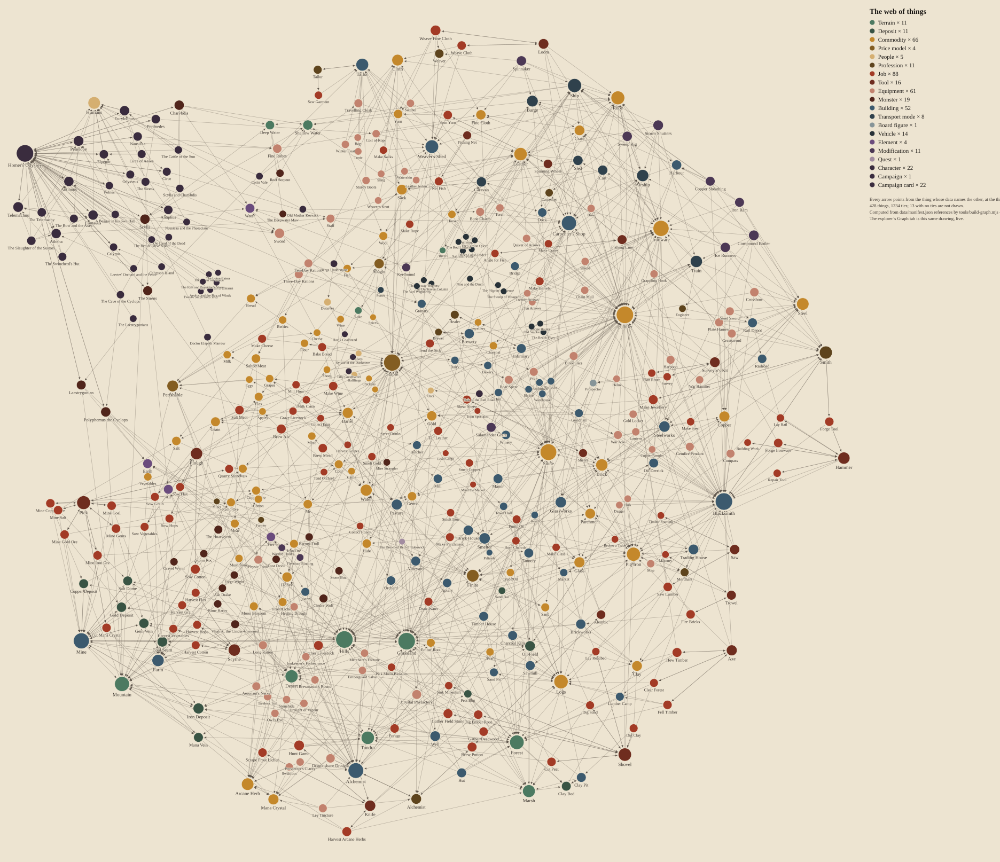

## The flows of work

The web above, taken apart: one diagram per place of work, with everything
unrelated removed. Read each row left to right — what goes **in** on the
left, with a note under each thing saying where it comes from; the **job**
in the middle with its hours, its tool and who works it; what comes **out**
on the right. To get what you want, find the thing on the right of some row
and walk left, diagram to diagram, until every input is something you can
gather. The explorer’s **Flows** tab is these same diagrams, live, with
every box clickable.

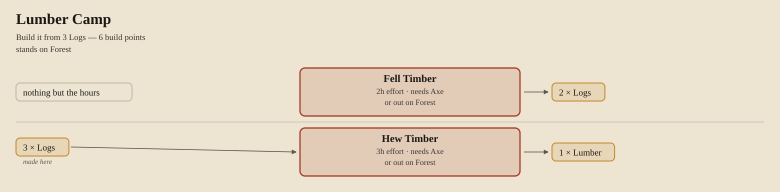

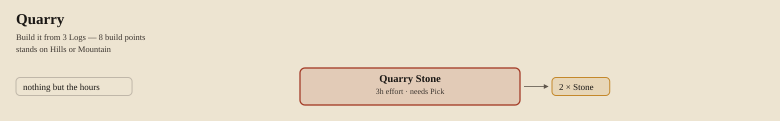

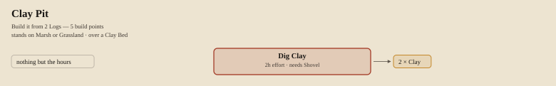

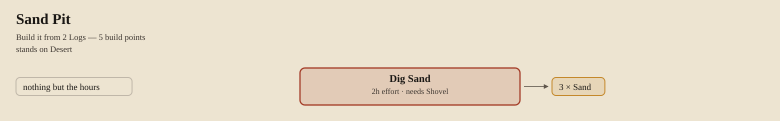

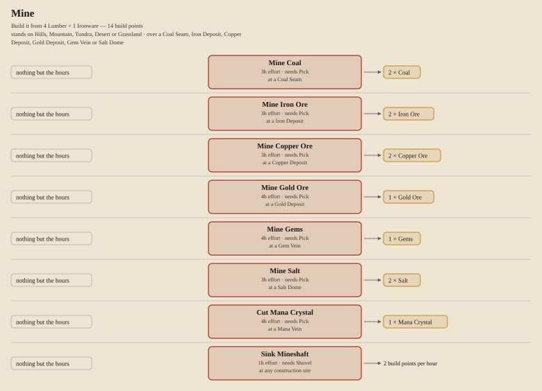

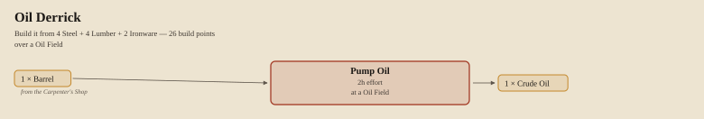

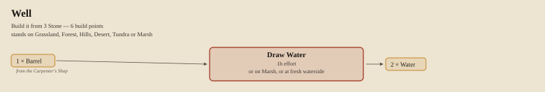

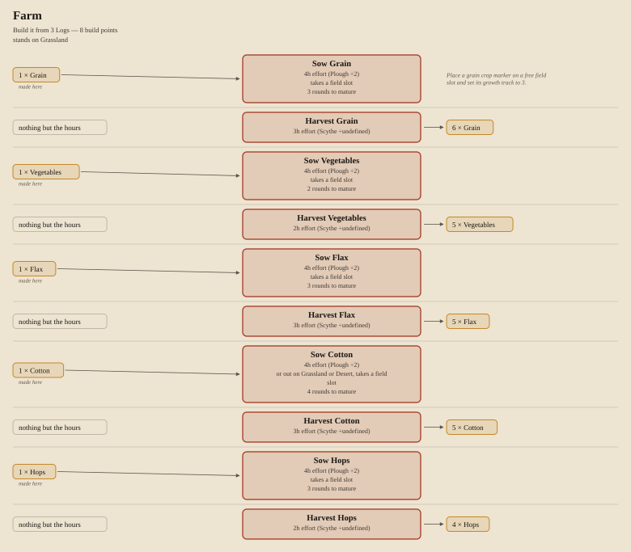

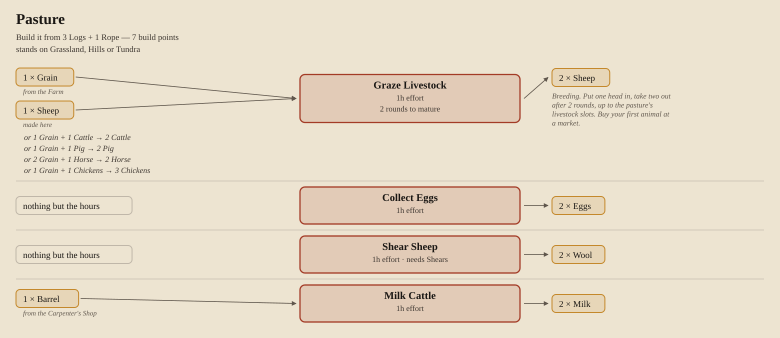

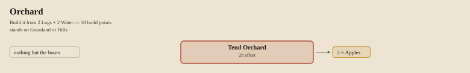

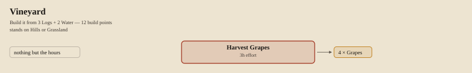


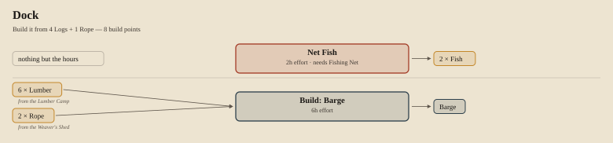

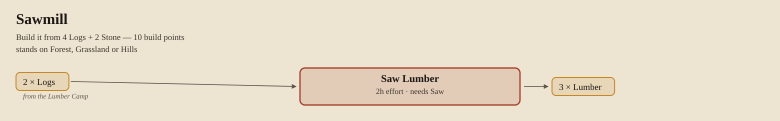

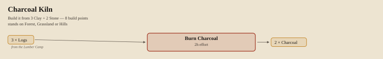

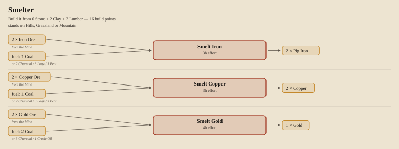

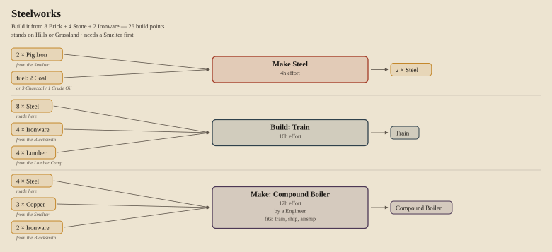

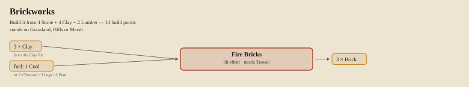

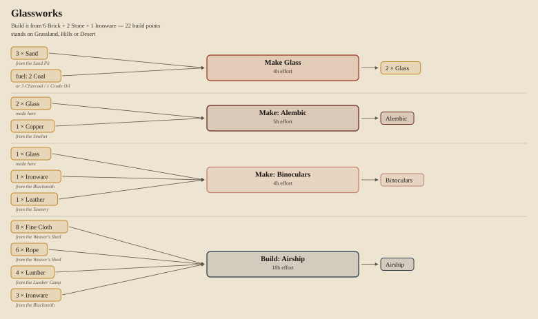

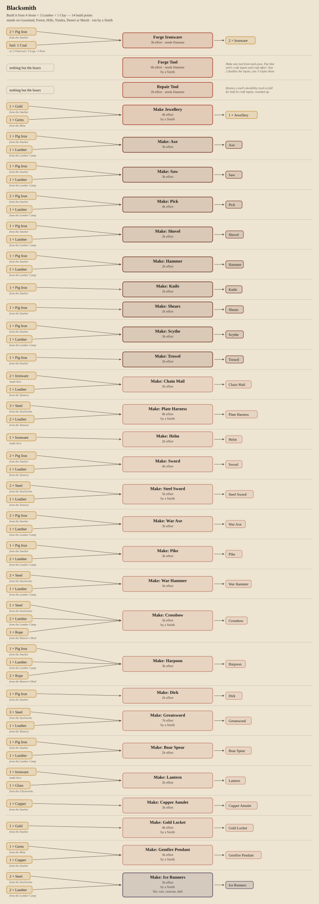

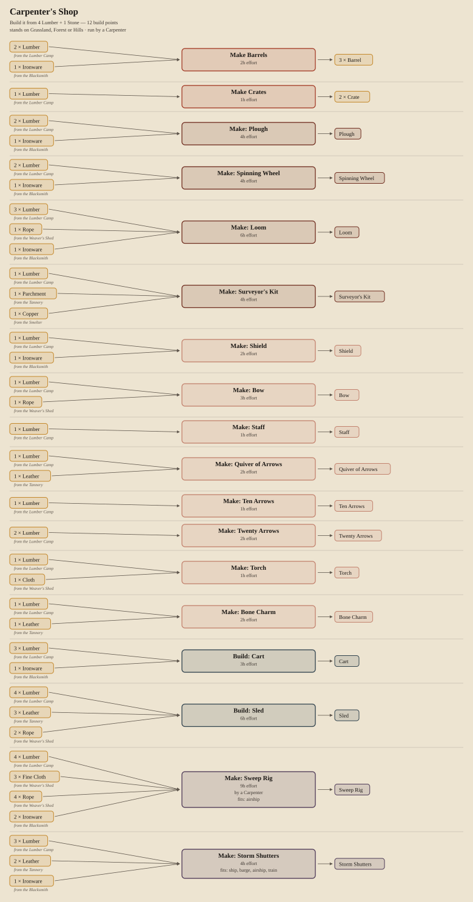

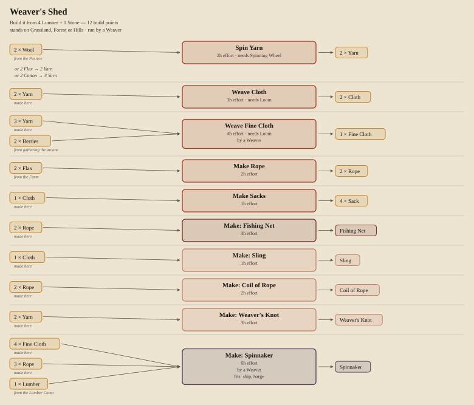

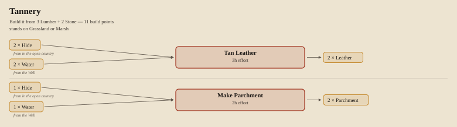

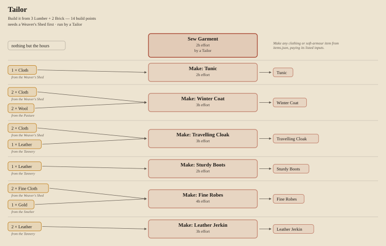

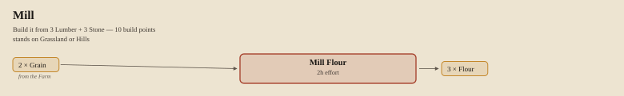

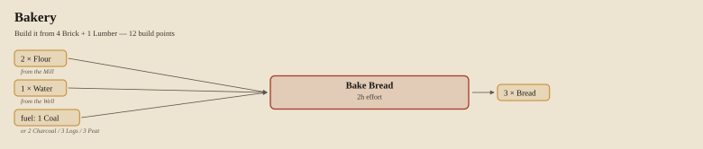

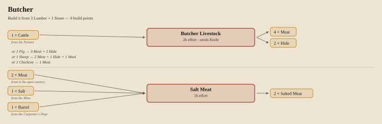

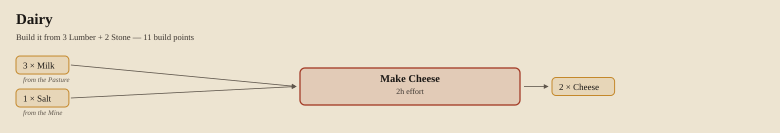

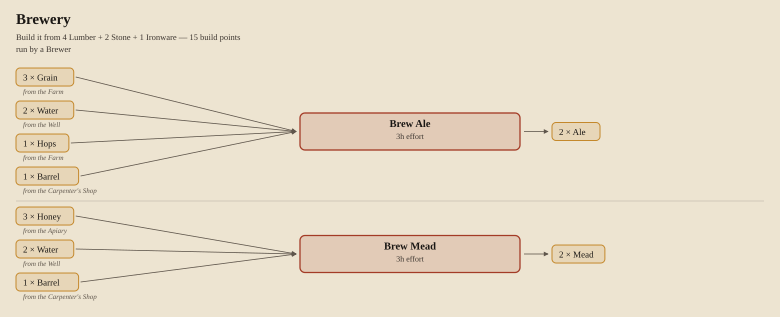

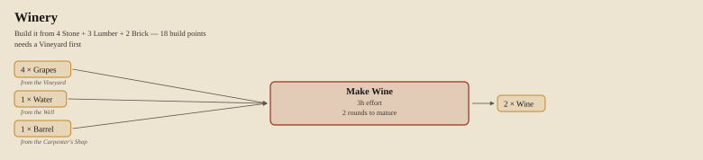

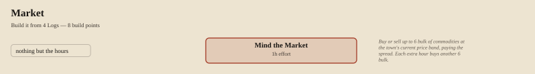

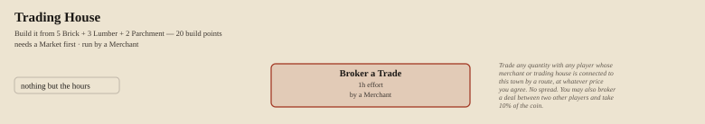

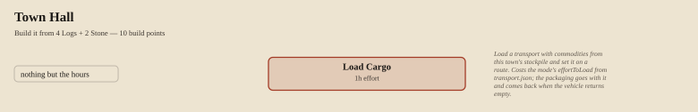

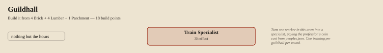

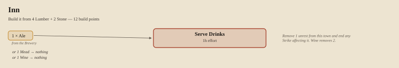

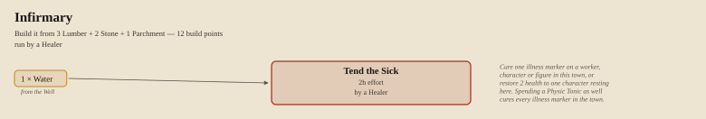

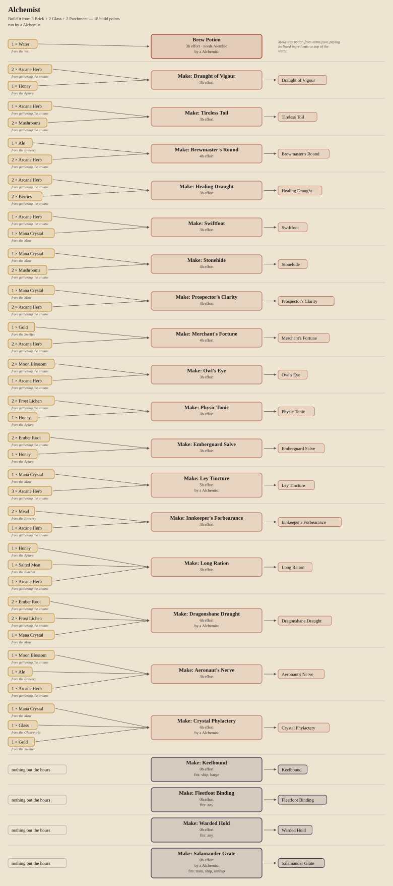

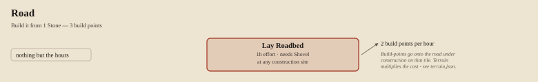

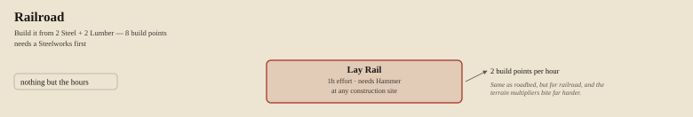

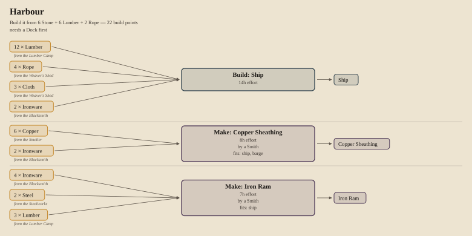

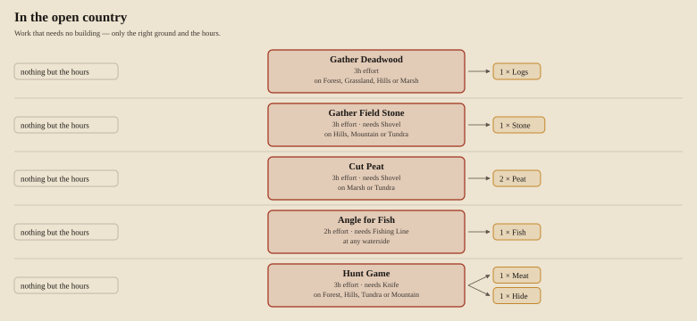

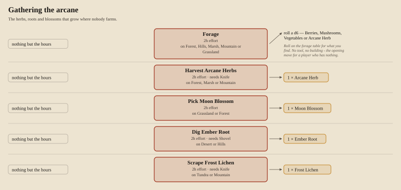

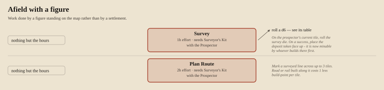

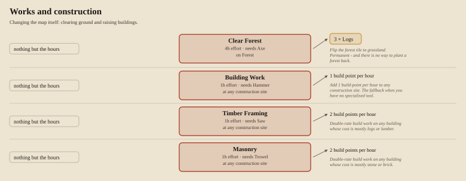

## Terrain

The letter code is printed in the bottom corner of every hex on every map.
It is the ruling when the artwork straddles a grid line, and it keys the
travel and discovery tables below.

| Code | Terrain | Move | Road × | Rail × | Features | Deposits |
| --- | --- | --- | --- | --- | --- | --- |
| **G** | Grassland | 1 | 1 | 1 | trees-sparse | clay-bed, coal-seam, iron-deposit, salt-dome, oil-field, gold-deposit |
| **F** | Forest | 2 | 2 | 2 | trees-dense, game, herbs | clay-bed, iron-deposit, mana-vein |
| **H** | Hills | 2 | 2 | 3 | stone, game, caves | coal-seam, iron-deposit, copper-deposit, gold-deposit, gem-vein, mana-vein |
| **M** | Mountain | 4 | 4 | 6 | stone, herbs, caves | coal-seam, iron-deposit, copper-deposit, gold-deposit, gem-vein, mana-vein |
| **B** | Marsh | 3 | 3 | 4 | reeds, herbs, fresh-water | clay-bed, peat-bog, oil-field |
| **T** | Tundra | 2 | 2 | 2 | game | coal-seam, iron-deposit, oil-field, peat-bog |
| **D** | Desert | 2 | 2 | 2 | sand, salt | salt-dome, oil-field, gem-vein |
| **R** | River | boat | — | — | fish, fresh-water, reeds | — |
| **L** | Lake | boat | — | — | fish, fresh-water, reeds | — |
| **S** | Shallow Water | boat | — | — | fish | — |
| **O** | Deep Water | boat | — | — | fish | — |

## Travel speeds — hexes per day leg

| Mode | **G** | **F** | **H** | **M** | **B** | **T** | **D** | **R** | **L** | **S** | **O** |
| --- | --- | --- | --- | --- | --- | --- | --- | --- | --- | --- | --- |
| On Foot | 4 | 2 | 2 | 1 | 1 | 2 | 2 | — | — | — | — |
| Mounted | 6 | 2 | 3 | 1 | 1 | 3 | 3 | — | — | — | — |
| Cart | 3 | 1 | 1 | — | — | 1 | 2 | — | — | — | — |
| Caravan | 2 | 1 | 1 | — | — | 1 | 2 | — | — | — | — |
| Barge | — | — | — | — | — | — | — | 3 | 3 | 3 | — |
| Ship | — | — | — | — | — | — | — | — | — | 3 | 5 |
| Sled | 1 | 1 | 2 | 2 | 2 | 5 | — | 2 | 2 | 2 | — |
| Airship | 5 | 5 | 5 | 4 | 5 | 5 | 5 | 5 | 5 | 5 | 5 |

Overrides: **On a Road** — on-foot 5, mounted 8, cart 6, caravan 4; **On Rail** — train 6.

## Night legs

| Light | Night speed |
| --- | --- |
| None | No travel at all, even on a road |
| Torch | 1 hex (2 on a road); spends one use |
| Lantern | Half day speed, rounded up |
| Owl’s Eye potion | As a lantern, for one round |

A night leg triggers a second discovery roll with the monster band widened by 1.
Trains run at night at full speed with a lantern fitted; ships sail at half speed with one rigged.
Caves can only be entered with a lit torch or lantern.

## Discovery tables — d20, roll where the leg ends

One roll per movement leg, on the table for the hex you **stopped** in. A road
or rail on the hex overrides its terrain. Persistent results are marked on the
hex with a tile or figure.

| Table | Bands |
| --- | --- |
| Grassland (G) | 1 bandits · 2-4 traveller · 5-14 nothing · 15-16 commodity-trace · 17-19 monster · 20 quest-omen |
| Forest (F) | 1 bandits · 2-3 traveller · 4-11 nothing · 12-14 commodity-trace · 15-19 monster · 20 quest-omen |
| Hills (H) | 1 bandits · 2-3 traveller · 4-10 nothing · 11-13 commodity-trace · 14-15 cave-mouth · 16-19 monster · 20 quest-omen |
| Mountain (M) | 1 hazard · 2 traveller · 3-8 nothing · 9-11 commodity-trace · 12-14 cave-mouth · 15-19 monster · 20 quest-omen |
| Marsh (B) | 1 hazard · 2 traveller · 3-10 nothing · 11-12 commodity-trace · 13-19 monster · 20 quest-omen |
| Tundra (T) | 1-2 hazard · 3 traveller · 4-11 nothing · 12-13 commodity-trace · 14-19 monster · 20 quest-omen |
| Desert (D) | 1-2 hazard · 3 traveller · 4-9 nothing · 10-11 commodity-trace · 12-19 monster · 20 quest-omen |
| River (R) | 1-2 hazard · 3-5 traveller · 6-13 nothing · 14 flotsam · 15-16 merchant · 17-19 monster · 20 quest-omen |
| Lake (L) | 1 hazard · 2-3 traveller · 4-13 nothing · 14-15 flotsam · 16-19 monster · 20 quest-omen |
| Shallow Water (S) | 1 hazard · 2-3 flotsam · 4-13 nothing · 14-15 pirates · 16-19 monster · 20 quest-omen |
| Deep Water (O) | 1-2 hazard · 3 flotsam · 4-12 nothing · 13-15 pirates · 16-19 monster · 20 quest-omen |
| On a Road | 1-2 bandits · 3-7 merchant · 8-10 traveller · 11-17 nothing · 18-19 monster · 20 quest-omen |
| On the Rail | 1-2 bandits · 3-5 merchant · 6-7 traveller · 8-17 nothing · 18-19 monster · 20 quest-omen |
| Inside a Cave | 1-2 hazard · 3-8 nothing · 9-12 commodity-trace · 13-16 monster · 17-19 hoard · 20 quest-omen |

Monster element weights by table:

| Table | Fire | Earth | Water | Air |
| --- | --- | --- | --- | --- |
| Grassland (G) | 1 | 2 | 1 | 2 |
| Forest (F) | 1 | 3 | 1 | 1 |
| Hills (H) | 2 | 3 | 0 | 1 |
| Mountain (M) | 2 | 2 | 0 | 2 |
| Marsh (B) | 0 | 2 | 3 | 1 |
| Tundra (T) | 0 | 1 | 2 | 3 |
| Desert (D) | 3 | 2 | 0 | 2 |
| River (R) | 0 | 2 | 3 | 1 |
| Lake (L) | 0 | 1 | 3 | 1 |
| Shallow Water (S) | 0 | 0 | 4 | 1 |
| Deep Water (O) | 0 | 0 | 4 | 1 |
| On a Road | 1 | 2 | 1 | 1 |
| On the Rail | 1 | 2 | 0 | 1 |
| Inside a Cave | 2 | 3 | 1 | 0 |

## The market

Every Market phase, one player rolls for every column on the ledger: two **blue** dice
for demand, two **red** for supply, one **green** for volatility, and then whatever the
good’s own nature adds. Find the net on the swing ruler, and step the price that many
places along the row of six printed for that commodity below.

```
Demand − Supply + Volatility + Modifier
```

**The whole sum is addition, and the multiplication is not hiding anywhere.**
There is none, anywhere in the round. Not in the die, not in the modifier, not in the price - the price ladder is a printed table, not a sum.
Nothing is halved and nothing is rounded, because there is nothing left in the line for a
rounding to happen to — and that is what the rebuild was for. The version before this one
multiplied the swing by the green die and folded the modifier in *first*, which is three
chances to slip in a line a table works through once per traded commodity per round. They
got slipped.

| Dice | Ink | Range | What it is | What it does |
| --- | --- | --- | --- | --- |
| 2 d6 | **blue** | 2–12 | **Demand** | How badly the town wants the stuff this season. Two dice rather than one because a market is a crowd, and a crowd averages: 7 is an ordinary appetite and 12 is a famine year. Blue is added, always - in a market and in a fight. |
| 2 d6 | **red** | 2–12 | **Supply** | How much of it turned up. It is also the CAP on what the board will sell this round - see `stockCap` - so a low red roll is a shortage twice over: dear, and rationed. Red is subtracted, always. |
| 1 d6 | **green** | 1–6 | **Volatility** | How rough the season is. Read on the volatility strip printed on the market board: it adds minus two, nothing, or plus two, and that is the whole of it. |
| 1 d6 | **ochre** | 1–6 | **Spoil** | What the season takes back. Rolled at the end of every round against any perishable goods still in a player's hands, and read on the spoil strip. It never touches a price. |

**Blue is what you want and red is what stands in your way** — here, and in a fight. The
same two colours, the same subtraction, the same direction (`rules.json conflict.battle`),
so a player who has rolled one market has already learned how a battle is scored. That is
worth more than either system’s private preference about which colour ought to mean which,
and it is why the two pairs swapped when the sum did.

There are five kinds of die and one ink apiece. The one purple **Mana**
die (`arcana.json manaDie`) is the fifth, and it is not a market die at all — it is what a
dead monster gives up. You take the LESSER of the monster's Y box and the roll. Never more than the monster had; often less. It is named here because the palette is the
interface: five inks, five kinds of die, and no sixth ink left to make a seventh out of,
which is a constraint worth having rather than a shortage.

Six dice for the whole table, not six per player. One player rolls the market for every line on the ledger; every player rolls the spoil die for their own perishables.

### Volatility — the green die

It was called **elasticity** and it **multiplied** — ×1, ×2, ÷2 — and neither the name nor
the multiplication survived. Elasticity is a word for how much a quantity answers a price,
which is not what this die was ever doing: it is a weather roll on a market, and volatility
is the word for that. Three cells, two faces each, and it adds.

| Green die | Season | Adds | What it means |
| --- | --- | --- | --- |
| **1–2** | **Slack** | **−2** | A quiet season with nobody pushing. Two off the swing, whichever way it fell. |
| **3–4** | **Even** | **0** | An ordinary season. The dice are the whole story. |
| **5–6** | **Rough** | **+2** | A thin, jumpy market. Two on, and this is where the spikes come from. |

It ADDS, so it can turn a swing around: a -1 in a rough season is a +1, and a +1 in a slack one is a -1. A multiplier could never do that, and a market that is never turned over by the weather is a market with no weather in it.

### The swing ruler

| Net | **≤ −9** | **−8 … −5** | **−4 … −2** | **−1 … +1** | **+2 … +4** | **+5 … +8** | **≥ +9** |
| --- | --- | --- | --- | --- | --- | --- | --- |
| Places | −3 | −2 | −1 | hold | +1 | +2 | +3 |
|  | crash | slump | soften | hold | firm | rally | spike |

**The bins were re-cut when the multiplier went, and they had to be.** Two blue dice
against two red is a triangular spread peaking at nothing (−10 to +10); the green die
widens it by two either way; so the whole net runs −12 to +12 before any
modifier, where the old multiplied one reached 26. Left where they were, the old bins on
the new net would have moved three places in no round of any game ever played, because the
dice could no longer reach the cell.

Cut where they are now, over all 7776 rolls of the five dice with no modifier, the market **holds in 29.9%
of rounds, moves one place in 45.8%, two in 22.2% and three in 2.1%** — so it moves in about
seven rounds in ten, two places is a genuinely one-sided market rather than a weekly event,
and three only happens when the dice and the good’s own nature are pulling together. Those
figures are worked out from the bins rather than claimed, and `validate-data.mjs` separately
refuses to let the ruler have a hole in it — every value the dice and the modifiers can
actually reach has to land in a cell. (2−12) at the extremes, plus a volatility of ±2, plus a modifier that runs -3 for a sought good in freefall and +6 for a seam that is worked out: -15 to +18.

A price at the top of its row that is told to go up stays where it is, and the same at the
foot. A market can be at its ceiling; it cannot be above it.

The board sells at most Supply tokens of that commodity before the next Market phase, first come first served in turn order through the Actions phase. It will buy any quantity - a market always has room for more of what nobody wants.

### What kind of good it is

This section was called *what a market remembers*, and the title had to go, because nothing
remembers anything now. **There is no memory strip and there is no tally.** Every line on
the old market board carried both — a modifier from −3 to +3 walked by a bar, and beside it
a count of the board’s own stock that filled every few tokens traded, emptied, and stepped
the modifier one cell in whatever direction the commodity’s model said.

**What that machinery bought was real, and it is worth saying before it is thrown away.** It
gave a market a history instead of a mood, it was legible across a table, and it put the
consequence of trading in the same gesture as the trade. **What it cost** was three pieces
to walk per line per round, a board that had to be re-laid every time a model wanted a
different range, and a modifier that went in *before* the multiplication — so a market’s
history counted double in a volatile season, for no reason anybody could defend.

Every commodity in the game is exactly one of **four kinds of good**, and the kind is engraved in
the corner of that commodity’s own token, so the piece you stand in a ledger column tells
you how that column behaves. Two of the four add nothing to the sum at all. The other
two read their number off something already on the table for another reason — the
depletion grid the pips were going on anyway, and the move box that was being written
anyway. That is what let the board stop tracking anything.

| Mark | Kind | Adds to the swing | What it does instead | Goods |
| --- | --- | --- | --- | --- |
|  | **Staple** | **nothing** | — | 34 |
|  | **Perishable** | **nothing** | The ochre spoil die, at the end of the Feeding phase, before the market is rolled, against every stack of it a player is still holding. | 11 |
|  | **Finite** | the lowest number still visible on its own depletion grid, **0 to +6** | One token per unit consumed. Cover the lowest uncovered cell. Trading does none of it: buying and selling move a commodity; they do not spend it. | 14 |
|  | **Sought** | the move it made **last** round, **−3 to +3**, read off the move box on the ledger row above | — | 7 |

** Staple — “It is worth what it is worth.”** Anything durable that is neither dug out of a finite hole nor coveted for its own sake. The default, and the largest of the four by a long way.

Most of what is bought and sold, in this game and everywhere else. Stone, lumber, cloth, rope, ale. It keeps, it is not running out, and nobody wants it for what owning it says about them - so its price is the crowd wanting it against the amount that turned up, and there is no story underneath.

The model exists so the other three mean something. A game where every good has a special rule is a game where no good does.

*The mark: **level beam**.* A balance, hanging level. Nothing on either pan, nothing tipping it - which is the whole of what this model says. It is the only mark in the set that is symmetrical, and that is doing the work: the other three are all lopsided, because the other three all lean one way.

** Perishable — “What you do not shift, you lose.”** Anything that rots: food off the field, milk, meat, fish, fruit, and the one arcane herb that will not dry.

The oldest problem in any market that grows things. The stuff turns up whether anybody wants it or not, it keeps badly, and what is still in the warehouse when the season turns is not an asset, it is a smell. A good harvest is a bad year, and it is a bad year for the person holding the harvest rather than for the market.

This is where the old GLUT model went. Glut bent the price down through a memory strip, which was a fair model of a market and a poor model of a fish: it punished the town for what the farmer did, and it never once made anybody hurry. The spoil die punishes the person actually holding the stuff, at the end of the round they failed to shift it, which is both truer and considerably more urgent.

*The mark: **picked clean**.* A fish skeleton: snout, spine, ribs, forked tail. It says gone off in every kitchen in the world and it engraves at chit size as five strokes and a fork. The first draft was a heaped measure overflowing its rim, which is a picture of a glut - and a glut is precisely what this model stopped being about.

| Ochre die | Keeps well | Keeps poorly | What it is |
| --- | --- | --- | --- |
| **1–2** | 0 | 1 | A cold week. |
| **3–4** | 1 | 2 | The ordinary loss. |
| **5–6** | 2 | 3 | It turned. |

A commodity whose `perishRounds` is under 3 keeps **poorly** and reads the right-hand
column; everything else reads the left, and that is the whole of the difference
`perishRounds` makes now. You cannot lose more than you hold. A stack of one that is told to lose three loses one. A stack held in a granary reads one row up the strip - a 5 or a 6 costs what a 3 or a 4 costs, and a 1 or a 2 costs nothing at all. That is what a granary is for, and it is why it takes food and drink and nothing else (rules.json storage.granaryAcceptsOnly).

**It never touches a price.** A perishable's price is the dice and nothing but the dice. What spoilage does to a market it does through the market's own front door: units that rot are units nobody sells, and the town notices that the same way it notices everything else.

** Finite — “The easy ore came out first.”** Anything a deposit yields, and anything smelted straight out of one. tools/validate-data.mjs checks the first half of that: a commodity a deposit yields and does not price by depletion is a hole in the ground that never runs dry.

The rule for anything that comes out of a hole. The first seam is at the surface and the last one is under water at the bottom of a shaft, so every ton that leaves makes the next ton dearer to win - and none of it grows back inside a lifetime. A mining town's prices only ever go one way, and the boom is the part before everybody notices.

What changed is what counts as leaving. It used to be selling: a tally on the market board filled as tokens crossed to the board, and a market could be worked out by a merchant who never lit a fire. It is BURNING now. Coal that is traded is coal that still exists; coal that is fed to a furnace is gone, and only the furnace moves the number.

*The mark: **run glass**.* A glass with the sand already down in the bottom bulb. Not a pick and not a shaft: what this model is about is the sand, not the digging - and not a trickle either, because a trickle drawn between two converging lines is invisible at the size this is engraved.

| Units burnt | **0–2** | **3–5** | **6–8** | **9–11** | **12–14** | **15–17** | **18+** |
| --- | --- | --- | --- | --- | --- | --- | --- |
| The grid reads | 0 | +1 | +2 | +3 | +4 | +5 | +6 |

Seven rows of three cells, nought at the top and six at the bottom, 21 cells in all.
Cover from the lowest row up, and the modifier is **the lowest number you can still see**.
Nothing is written down and nothing is counted — you look at the grid and read the
smallest number left on it, and a fresh grid reads nought.

At the top row the seam is as good as worked out: the line spends the rest of the game bid up by six before a die is thrown, which on the swing ruler is two bands of rally with no help from anybody. The town that owns the last deposit owns the market, and it always did - this is the version of that sentence you can see across a table.

** Sought — “It is bought because it is going up.”** The luxury trade: low bulk, high value, wanted for what it is rather than for what it does.

The market that runs on its own reputation. Nobody needs a jewel, a bolt of fine cloth or a famous horse - they want it because of what owning it says, and what it says is loudest when everybody can see the price climbing. So a rise makes buyers and buyers make a rise, until the day it does not and the whole thing runs the other way just as fast.

*The mark: **rising run**.* A run of prices going up, with the arrow at the top of it. The one mark in the set that says which way it is pointing.

At setup nothing has moved, so every sought line starts on nothing, and the first round is played on the dice alone. It is a feedback loop with a floor and a ceiling and no memory beyond one round, which is exactly the shape of the thing it is modelling. A rise makes buyers and buyers make a rise, until a bad roll turns it and the same machinery runs the other way just as fast. Two rounds of quiet and it is back to nothing, because a move of zero is what the next round reads.

### Every price in the game

**A price move is a step along one of these rows.** The price you last wrote in a ledger
column is one of the six figures in that commodity’s row; the swing ruler says how many
places to step; the figure you land on is the new price. There is no band index to
remember, no token to walk and nothing to multiply — which is exactly what let the price
ladder come off the market board with nothing replacing it (`rules.json market.$bandNote`,
`data/ledger.json`).

That is 66 commodities by 6 bands — 396 multiplications, all of them the same ones every
game, and every one of them formerly done at a table, because a token standing on a cell
tells you a band index and not a price. They are done here instead, once, at the press, by
a tool that cannot get one wrong. The dearest figure below is **220**, which is why the ledger
prints three hollow figures per cell and not four.

| Commodity | Kind | ×0.5 | ×0.75 | ×1.0 | ×1.25 | ×1.5 | ×2.0 |
| --- | --- | --- | --- | --- | --- | --- | --- |
| Logs | Staple | 2 | 3 | 4 | 5 | 6 | 8 |
| Stone | Staple | 3 | 4 | 5 | 6 | 8 | 10 |
| Clay | Finite | 2 | 2 | 3 | 4 | 5 | 6 |
| Sand | Finite | 1 | 2 | 2 | 3 | 3 | 4 |
| Iron Ore | Finite | 3 | 5 | 6 | 8 | 9 | 12 |
| Copper Ore | Finite | 4 | 5 | 7 | 9 | 11 | 14 |
| Gold Ore | Finite | 7 | 11 | 14 | 18 | 21 | 28 |
| Salt | Finite | 3 | 5 | 6 | 8 | 9 | 12 |
| Water | Staple | 1 | 1 | 1 | 1 | 2 | 2 |
| Coal | Finite | 4 | 6 | 8 | 10 | 12 | 16 |
| Peat | Finite | 2 | 2 | 3 | 4 | 5 | 6 |
| Charcoal | Staple | 4 | 5 | 7 | 9 | 11 | 14 |
| Crude Oil | Finite | 8 | 12 | 16 | 20 | 24 | 32 |
| Lumber | Staple | 5 | 7 | 9 | 11 | 14 | 18 |
| Brick | Staple | 6 | 9 | 12 | 15 | 18 | 24 |
| Pig Iron | Finite | 7 | 11 | 14 | 18 | 21 | 28 |
| Steel | Finite | 13 | 20 | 26 | 33 | 39 | 52 |
| Copper | Finite | 9 | 14 | 18 | 23 | 27 | 36 |
| Gold | Sought | 20 | 30 | 40 | 50 | 60 | 80 |
| Glass | Staple | 10 | 15 | 20 | 25 | 30 | 40 |
| Rope | Staple | 4 | 6 | 8 | 10 | 12 | 16 |
| Leather | Staple | 6 | 8 | 11 | 14 | 17 | 22 |
| Ironware | Staple | 11 | 17 | 22 | 28 | 33 | 44 |
| Parchment | Staple | 8 | 11 | 15 | 19 | 23 | 30 |
| Wool | Staple | 3 | 5 | 6 | 8 | 9 | 12 |
| Flax | Staple | 3 | 4 | 5 | 6 | 8 | 10 |
| Cotton | Staple | 4 | 5 | 7 | 9 | 11 | 14 |
| Yarn | Staple | 6 | 9 | 12 | 15 | 18 | 24 |
| Cloth | Staple | 10 | 15 | 20 | 25 | 30 | 40 |
| Fine Cloth | Sought | 19 | 29 | 38 | 48 | 57 | 76 |
| Hide | Staple | 3 | 5 | 6 | 8 | 9 | 12 |
| Grain | Staple | 3 | 4 | 5 | 6 | 8 | 10 |
| Flour | Staple | 5 | 7 | 9 | 11 | 14 | 18 |
| Bread | Perishable | 7 | 11 | 14 | 18 | 21 | 28 |
| Vegetables | Perishable | 3 | 5 | 6 | 8 | 9 | 12 |
| Mushrooms | Perishable | 4 | 5 | 7 | 9 | 11 | 14 |
| Berries | Perishable | 3 | 4 | 5 | 6 | 8 | 10 |
| Apples | Perishable | 3 | 5 | 6 | 8 | 9 | 12 |
| Fish | Perishable | 4 | 5 | 7 | 9 | 11 | 14 |
| Meat | Perishable | 5 | 8 | 10 | 13 | 15 | 20 |
| Salted Meat | Staple | 9 | 14 | 18 | 23 | 27 | 36 |
| Milk | Perishable | 2 | 3 | 4 | 5 | 6 | 8 |
| Cheese | Staple | 8 | 12 | 16 | 20 | 24 | 32 |
| Honey | Staple | 6 | 9 | 12 | 15 | 18 | 24 |
| Eggs | Perishable | 3 | 4 | 5 | 6 | 8 | 10 |
| Grapes | Perishable | 4 | 6 | 8 | 10 | 12 | 16 |
| Hops | Staple | 4 | 5 | 7 | 9 | 11 | 14 |
| Ale | Staple | 12 | 18 | 24 | 30 | 36 | 48 |
| Mead | Sought | 16 | 24 | 32 | 40 | 48 | 64 |
| Wine | Sought | 20 | 30 | 40 | 50 | 60 | 80 |
| Sheep | Staple | 9 | 14 | 18 | 23 | 27 | 36 |
| Cattle | Staple | 15 | 23 | 30 | 38 | 45 | 60 |
| Pig | Staple | 10 | 15 | 20 | 25 | 30 | 40 |
| Chickens | Staple | 5 | 7 | 9 | 11 | 14 | 18 |
| Horse | Sought | 23 | 34 | 45 | 56 | 68 | 90 |
| Barrel | Staple | 4 | 6 | 8 | 10 | 12 | 16 |
| Crate | Staple | 3 | 5 | 6 | 8 | 9 | 12 |
| Sack | Staple | 2 | 2 | 3 | 4 | 5 | 6 |
| Spices | Sought | 23 | 34 | 45 | 56 | 68 | 90 |
| Gems | Finite | 30 | 45 | 60 | 75 | 90 | 120 |
| Jewellery | Sought | 55 | 83 | 110 | 138 | 165 | 220 |
| Arcane Herb | Staple | 10 | 15 | 20 | 25 | 30 | 40 |
| Mana Crystal | Finite | 28 | 41 | 55 | 69 | 83 | 110 |
| Moon Blossom | Perishable | 7 | 11 | 14 | 18 | 21 | 28 |
| Ember Root | Staple | 8 | 12 | 16 | 20 | 24 | 32 |
| Frost Lichen | Staple | 6 | 9 | 12 | 15 | 18 | 24 |

Every column starts on the **third** figure of its row. Buying from the board costs the
spread on top and selling to it takes the spread off — 15% either way, and it is the house
cut for trading with a board rather than with another player, not part of the price.

## Four markets, played

One scenario per kind of good, with the dice chosen to show what each one does — a worked
example shows the interesting case, not a random one. Everything after the dice is computed
from the tables above rather than transcribed, so these cannot drift out of true.

Read a row left to right and it is the round in the order it happens. Trading is an action
like any other and happens in the **Actions** phase, at the price the ledger is already
showing; the ochre die is rolled one phase later, at the end of **Feeding**; and the
**Market** phase then fixes the price everybody will trade at next round. You act on a
known price and find out afterwards what your acting did to it, which is the only honest
way round for a market to work. Sales to the board are at the ledger price less the house
cut, so a figure in that column is not the printed price and is not meant to be.

**Mod** is what the good’s own nature adds, and two of the four never leave nought.
**Net** is the whole sum. **The ruler** is the cell the net lands in, and after it the
figure that goes in the ledger’s move box — a dash when the price held, and the step the
price *actually took* rather than the one the ruler called for, on the rounds where it is
already standing at an end of its own row. **End of Feeding** and **Pips** are the two
columns that are not about the price at all: what the ochre die took, and how many units
have been burnt so far.

### A good harvest — Grain ·  Staple

Bram has a farm and a surplus, and sells it into his own town three rounds running. Base value 5¤, so the row is **3 · 4 · 5 · 6 · 8 · 10**, and
every column starts on the third figure of it — 5¤ a sack.

| # | In the round | D − S | Green | Mod | Net | The ruler | Price |
| --- | --- | --- | --- | --- | --- | --- | --- |
| 1 | His first surplus, into a town that already has plenty. Sells **3** at 4.25¤ = **12.75¤** | 7 − 11 | 3 · 0 | 0 | −4 | soften −1 | **4¤** |
| 2 | A thin market — and he sells into it anyway. Sells **3** at 3.40¤ = **10.20¤** | 11 − 5 | 4 · 0 | 0 | +6 | rally +2 | **6¤** |
| 3 | And again, four sacks this time. Sells **4** at 5.10¤ = **20.40¤** | 6 − 8 | 2 · −2 | 0 | −4 | soften −1 | **5¤** |
| 4 | Nobody trades a sack all round. | 9 − 7 | 5 · +2 | 0 | +4 | firm +1 | **6¤** |
| 5 | A famine year. | 12 − 3 | 5 · +2 | 0 | +11 | spike +2 *(the top of the row)* | **10¤** |

**After five rounds — Grain at 10¤ a sack.** Ten sacks sold into one town, and not one of them moved the row a place. That is the staple bargain stated plainly: a price is the crowd wanting it against the amount that turned up, and one farmer with a cart is neither of those things. Under the memory strip those ten sacks would have filled a tally twice over and bent the price down under him — which punished the town for what the farmer did, and is the job the fish skeleton took over and now does to the person actually holding the stock.

### The catch — Fish ·  Perishable

Nella lands fish at a coast village and cannot shift it fast enough. Base value 7¤, so the row is **4 · 5 · 7 · 9 · 11 · 14**, and
every column starts on the third figure of it — 7¤ a crate.

| # | In the round | D − S | Green | Mod | Net | The ruler | Price | End of Feeding |
| --- | --- | --- | --- | --- | --- | --- | --- | --- |
| 1 | A good first haul. Lands **5** · sells **2** at 5.95¤ = **11.90¤** | 11 − 5 | 3 · 0 | 0 | +6 | rally +2 | **11¤** | ochre **4** — 2 gone, 1 left |
| 2 | Four more out of the water, three away. Lands **4** · sells **3** at 9.35¤ = **28.05¤** | 7 − 10 | 5 · +2 | 0 | −1 | hold — | **11¤** | ochre **2** — 1 gone, 1 left |
| 3 | The last crate goes, and there is nothing left to roll against. Sells **1** at 9.35¤ = **9.35¤** | 5 − 10 | 2 · −2 | 0 | −7 | slump −2 | **7¤** | nothing held |
| 4 | Six crates, and no market day to sell them into. Lands **6** | 8 − 7 | 4 · 0 | 0 | +1 | hold — | **7¤** | ochre **6** — 3 gone, 3 left |
| 5 | What survived, sold. Sells **3** at 5.95¤ = **17.85¤** | 10 − 6 | 3 · 0 | 0 | +4 | firm +1 | **9¤** | nothing held |

**After five rounds — Fish at 9¤ a crate.** Fifteen crates out of the water, nine sold and **six thrown away** — and the price did exactly what the blue and red dice said in all five rounds, because a perishable adds nothing whatever to the swing. Everything that happened to Nella happened at the end of a round, in her own hands. That is the trade the spoil die made: glut moved the price everybody traded at, which left the player with a hold full of fish no worse off than the player with none, and slightly better informed. The die is aimed at the person holding the stuff, on the round they failed to shift it, and it needs one die and no strip on any board.

### The seam runs out — Coal ·  Finite

A smelting town, its furnaces, and one merchant who thinks she is working the market. Base value 8¤, so the row is **4 · 6 · 8 · 10 · 12 · 16**, and
every column starts on the third figure of it — 8¤ a load.

| # | In the round | D − S | Green | Mod | Net | The ruler | Price | Pips |
| --- | --- | --- | --- | --- | --- | --- | --- | --- |
| 1 | The town lights its furnaces. Burns **3** | 8 − 8 | 3 · 0 | +1 | +1 | hold — | **8¤** | 3 |
| 2 | Ilsa sells twelve loads to the board. Watch what it does to the price. Sells **12** at 6.80¤ = **81.60¤** · burns **3** | 7 − 9 | 4 · 0 | +2 | 0 | hold — | **8¤** | 6 |
| 3 | A busy week at the smelter, and a roll that says nothing at all. Burns **4** | 7 − 7 | 3 · 0 | +3 | +3 | firm +1 | **10¤** | 10 |
| 4 | A bad roll — and look what it does not do. Burns **3** | 5 − 9 | 2 · −2 | +4 | −2 | soften −1 | **8¤** | 13 |
| 5 | Everything they have, into the furnace. Burns **5** | 9 − 8 | 4 · 0 | +6 | +7 | rally +2 | **12¤** | 18 |

**After five rounds — Coal at 12¤ a load.** Eighteen loads burnt, the grid reading **+6**, and it will never read less again — the third round is the one to look at, where a roll that came to nothing put the price up a place on the strength of the grid alone. Ilsa’s twelve loads in round two did nothing at all, and that is the model rather than an oversight: selling coal to a town moves coal, burning it destroys coal, and only the burning is what a seam notices. A merchant who never lights a fire can trade the same hundred tons all game and the hill will not run dry from the paperwork.

### A run on gold — Gold ·  Sought

Nobody trades a single ingot in five rounds. A sought line does all of this on its own. Base value 40¤, so the row is **20 · 30 · 40 · 50 · 60 · 80**, and
every column starts on the third figure of it — 40¤ an ingot.

| # | In the round | D − S | Green | Mod | Net | The ruler | Price |
| --- | --- | --- | --- | --- | --- | --- | --- |
| 1 | Gold firms. Nothing has moved yet, so there is nothing to add. | 11 − 5 | 3 · 0 | 0 | +6 | rally +2 | **60¤** |
| 2 | The run builds, and now it is adding its own last move. | 9 − 6 | 2 · −2 | +2 | +3 | firm +1 | **80¤** |
| 3 | A roll that says nothing, with a slack season under it. | 7 − 8 | 4 · 0 | +1 | 0 | hold — | **80¤** |
| 4 | The turn. | 4 − 11 | 2 · −2 | 0 | −9 | crash −3 | **40¤** |
| 5 | And it runs the other way just as fast. | 6 − 9 | 3 · 0 | −3 | −6 | slump −2 | **20¤** |

**After five rounds — Gold at 20¤ an ingot.** Two places up, then one, then a dash; then three down and two. Gold went from 40¤ an ingot to 80¤ and finished at 20¤, the foot of its own row, without a single ingot changing hands. The whole memory of that is one pencil figure in the move box of the row above, and the third round is where the machinery shows: the price held, so the box got a dash, and a dash is what round four had to add. Two quiet rounds and a sought good is priced on the dice like anything else.

## Commodities

**Value** is the base value the row of six above is worked out from, not a price anybody
ever pays: what a town pays is the un-struck figure in that commodity’s ledger column.
**Keeps** is the column of the spoil strip a stack of it reads at the end of a round, and
only a perishable has one.

| Commodity | Category | Bulk | Value | Prices by | Keeps | Tags |
| --- | --- | --- | --- | --- | --- | --- |
| Logs | raw | 2 | 4 |  Staple | — | bulky |
| Stone | raw | 2 | 5 |  Staple | — | bulky |
| Clay | raw | 2 | 3 |  Finite | — | bulky |
| Sand | raw | 2 | 2 |  Finite | — | bulky |
| Iron Ore | raw | 2 | 6 |  Finite | — | bulky, ore |
| Copper Ore | raw | 2 | 7 |  Finite | — | bulky, ore |
| Gold Ore | raw | 2 | 14 |  Finite | — | bulky, ore |
| Salt | raw | 1 | 6 |  Finite | — | preservative |
| Water | raw | 1 | 1 |  Staple | — | liquid |
| Coal | fuel | 2 | 8 |  Finite | — | bulky, fuel |
| Peat | fuel | 2 | 3 |  Finite | — | bulky, fuel |
| Charcoal | fuel | 1 | 7 |  Staple | — | fuel |
| Crude Oil | fuel | 2 | 16 |  Finite | — | liquid, fuel, late-game |
| Lumber | material | 1 | 9 |  Staple | — | building-material |
| Brick | material | 2 | 12 |  Staple | — | building-material |
| Pig Iron | material | 1 | 14 |  Finite | — | metal |
| Steel | material | 1 | 26 |  Finite | — | metal, tier3 |
| Copper | material | 1 | 18 |  Finite | — | metal |
| Gold | material | 1 | 40 |  Sought | — | metal, precious |
| Glass | material | 1 | 20 |  Staple | — | fragile |
| Rope | material | 1 | 8 |  Staple | — | — |
| Leather | material | 1 | 11 |  Staple | — | — |
| Ironware | manufactured | 1 | 22 |  Staple | — | fittings |
| Parchment | manufactured | 1 | 15 |  Staple | — | — |
| Wool | textile | 1 | 6 |  Staple | — | — |
| Flax | textile | 1 | 5 |  Staple | — | — |
| Cotton | textile | 1 | 7 |  Staple | — | — |
| Yarn | textile | 1 | 12 |  Staple | — | — |
| Cloth | textile | 1 | 20 |  Staple | — | — |
| Fine Cloth | textile | 1 | 38 |  Sought | — | tier3 |
| Hide | textile | 1 | 6 |  Staple | — | — |
| Grain | food | 1 | 5 |  Staple | — | staple, seed |
| Flour | food | 1 | 9 |  Staple | — | — |
| Bread | food | 1 | 14 |  Perishable | well | staple |
| Vegetables | food | 1 | 6 |  Perishable | well | — |
| Mushrooms | food | 1 | 7 |  Perishable | **poorly** | foraged, potion-ingredient |
| Berries | food | 1 | 5 |  Perishable | **poorly** | foraged, potion-ingredient |
| Apples | food | 1 | 6 |  Perishable | well | — |
| Fish | food | 1 | 7 |  Perishable | **poorly** | — |
| Meat | food | 1 | 10 |  Perishable | **poorly** | — |
| Salted Meat | food | 1 | 18 |  Staple | — | preserved |
| Milk | food | 1 | 4 |  Perishable | **poorly** | liquid |
| Cheese | food | 1 | 16 |  Staple | — | preserved |
| Honey | food | 1 | 12 |  Staple | — | potion-ingredient |
| Eggs | food | 1 | 5 |  Perishable | **poorly** | — |
| Grapes | food | 1 | 8 |  Perishable | **poorly** | — |
| Hops | food | 1 | 7 |  Staple | — | — |
| Ale | drink | 2 | 24 |  Staple | — | liquid, morale |
| Mead | drink | 2 | 32 |  Sought | — | liquid, morale |
| Wine | drink | 2 | 40 |  Sought | — | liquid, morale, luxury-adjacent |
| Sheep | livestock | 2 | 18 |  Staple | — | breeds, eats |
| Cattle | livestock | 3 | 30 |  Staple | — | breeds, eats |
| Pig | livestock | 2 | 20 |  Staple | — | breeds, eats |
| Chickens | livestock | 1 | 9 |  Staple | — | breeds, eats |
| Horse | livestock | 3 | 45 |  Sought | — | breeds, eats, draught |
| Barrel | container | 1 | 8 |  Staple | — | reusable |
| Crate | container | 1 | 6 |  Staple | — | reusable |
| Sack | container | 0.5 | 3 |  Staple | — | reusable |
| Spices | luxury | 0.5 | 45 |  Sought | — | trade-good, import-only |
| Gems | luxury | 0.5 | 60 |  Finite | — | trade-good, theft-target |
| Jewellery | luxury | 0.5 | 110 |  Sought | — | trade-good, theft-target, tier3 |
| Arcane Herb | arcane | 0.5 | 20 |  Staple | — | foraged, potion-ingredient |
| Mana Crystal | arcane | 0.5 | 55 |  Finite | — | potion-ingredient, theft-target |
| Moon Blossom | arcane | 0.5 | 14 |  Perishable | **poorly** | foraged, potion-ingredient |
| Ember Root | arcane | 0.5 | 16 |  Staple | — | foraged, potion-ingredient |
| Frost Lichen | arcane | 0.5 | 12 |  Staple | — | foraged, potion-ingredient |

## Wear

**Everything a figure carries wears out**, and until recently only tools did. A sword was
immortal, a suit of plate never dented, a rope never frayed and a lantern burned forever —
so the only equipment decision anybody made twice was which axe to buy. One rule, one unit,
one scale: one wear-point per use, for a tool, a weapon, a coat and a coil of rope alike.

It is printed once, as the **W** box in the summary strip on the thing’s own card: the most
wear it will take, and like every number on a card it does not move, because the board took
the walking over. It is walked on the W track beside the item's own slot on the player board. Set it from the W box on the card when the thing is picked up, knock it down a rung each time the thing is used, and at 0 it is finished.

**The scale is the board’s.**
Wear used to run past thirty and be counted on the tool itself, because there was no track
for it; there are four now, one beside each kit slot, so the number came down to meet the
board rather than the board going up to meet the number. **Nothing got shorter doing it,**
because the clock changed with the scale: an axe had twenty-four wear at one a labour hour,
which is eight three-hour jobs, and has ten at one a job, which is ten. A tool lasts
slightly longer than it did and nobody adds hours up any more.

| Wears | What counts as a use | Why |
| --- | --- | --- |
| a tool | each recipe it is used in | Per job, not per hour. A worker who spends nine hours felling timber has run one job and blunted one axe by one. |
| a weapon, a shield, a helm or a suit of armour | each round of a battle it is swung or worn in | Both sides, win or lose. A blow you turned still dented the plate. |
| a light | each night leg it is burned on | Which is what a torch is: one wear, one night, gone. |
| anything else | each time its own card says | A rope that takes a party down a cliff, a grappling hook that holds, a bag that is stuffed past its seams. The card says what counts as a use, because a rope and a pair of boots do not wear for the same reason. |

**At 0.** Worn out. The card is discarded, the track is cleared, and whatever the thing was doing for its owner it stops doing at once - a broken tool does not refund the effort already spent on the job that broke it, and a sword that goes at 0 leaves you swinging with nothing for the rest of the battle.

**Repair.** Three points a round at any settlement with a blacksmith, four coin a point
and two hours of somebody’s labour. A thing may be mended any number of times; what cannot be mended is a thing at 0, which is not damaged, it is gone.

**What never wears:**

- Potions, which are drunk rather than worn out - the card is discarded on use and there is no W box on it.
- Talismans. Mana is not friction; a phylactery that has been filled and emptied a hundred times is a phylactery.
- Commodities, which are counted rather than owned.

## Tools

**W** is the most wear the tool will take, printed as the W box on its card and walked down
the W track beside its own kit slot. One point per **job**, never per hour: a worker who spends nine hours felling timber has run one job and blunted one axe by one.

| Tool | Made at | Craft | Hours | Value | W |
| --- | --- | --- | --- | --- | --- |
| Axe | blacksmith | 1 pig-iron + 1 lumber | 3 | 30 | 10 |
| Saw | blacksmith | 1 pig-iron + 1 lumber | 3 | 32 | 11 |
| Pick | blacksmith | 2 pig-iron + 1 lumber | 4 | 42 | 8 |
| Shovel | blacksmith | 1 pig-iron + 1 lumber | 3 | 28 | 9 |
| Hammer | blacksmith | 1 pig-iron + 1 lumber | 2 | 24 | 12 |
| Knife | blacksmith | 1 pig-iron | 2 | 18 | 8 |
| Shears | blacksmith | 1 pig-iron | 2 | 20 | 8 |
| Scythe | blacksmith | 1 pig-iron + 1 lumber | 3 | 30 | 9 (optional) |
| Plough | carpenter | 2 lumber + 1 ironware | 4 | 55 | 12 (optional) |
| Fishing Net | weaver | 2 rope | 3 | 26 | 8 |
| Fishing Line | blacksmith | 1 lumber + 1 rope + 1 ironware | 2 | 20 | 7 |
| Spinning Wheel | carpenter | 2 lumber + 1 ironware | 4 | 48 | 12 |
| Loom | carpenter | 3 lumber + 1 rope + 1 ironware | 6 | 70 | 14 |
| Trowel | blacksmith | 1 pig-iron | 2 | 20 | 10 |
| Surveyor's Kit | carpenter | 1 lumber + 1 parchment + 1 copper | 4 | 65 | 7 |
| Alembic | glassworks | 2 glass + 1 copper | 5 | 90 | 6 |

A size used to multiply durability as well, and it does not any more. A bigger loom is a FASTER loom, not a longer-lived one - and a multiplied wear number is a number the ceiling sweep cannot see, because it never appears in the data at the size it is actually walked at. One multiplier fewer, one hole in the ceiling fewer, and one thing less to work out at a table.

## Buildings

| Building | Category | Tier | Cost | Points | Terrain |
| --- | --- | --- | --- | --- | --- |
| Hut | housing | 1 | 2 logs | 4 | grassland, forest, hills, marsh, tundra |
| Timber House | housing | 2 | 4 lumber + 1 stone | 10 | grassland, forest, hills, tundra |
| Brick House | housing | 3 | 6 brick + 2 lumber + 1 ironware | 18 | grassland, hills, tundra, desert |
| Manor | housing | 4 | 8 brick + 4 stone + 2 glass + 1 fine-cloth | 30 | grassland, hills |
| Lumber Camp | extraction | 1 | 3 logs | 6 | forest |
| Quarry | extraction | 1 | 3 logs | 8 | hills, mountain |
| Clay Pit | extraction | 1 | 2 logs | 5 | marsh, grassland |
| Sand Pit | extraction | 1 | 2 logs | 5 | desert |
| Mine | extraction | 2 | 4 lumber + 1 ironware | 14 | hills, mountain, tundra, desert, grassland |
| Oil Derrick | extraction | 4 | 4 steel + 4 lumber + 2 ironware | 26 | — |
| Well | extraction | 1 | 3 stone | 6 | grassland, forest, hills, desert, tundra, marsh |
| Farm | extraction | 1 | 3 logs | 8 | grassland |
| Pasture | extraction | 1 | 3 logs + 1 rope | 7 | grassland, hills, tundra |
| Orchard | extraction | 2 | 2 logs + 2 water | 10 | grassland, hills |
| Vineyard | extraction | 2 | 3 logs + 2 water | 12 | hills, grassland |
| Apiary | extraction | 1 | 2 lumber | 5 | grassland, forest, hills |
| Dock | extraction | 1 | 4 logs + 1 rope | 8 | — |
| Sawmill | production | 1 | 4 logs + 2 stone | 10 | forest, grassland, hills |
| Charcoal Kiln | production | 1 | 3 clay + 2 stone | 8 | forest, grassland, hills |
| Smelter | production | 2 | 6 stone + 2 clay + 2 lumber | 16 | hills, grassland, mountain |
| Steelworks | production | 3 | 8 brick + 4 stone + 2 ironware | 26 | hills, grassland |
| Brickworks | production | 2 | 4 stone + 4 clay + 2 lumber | 14 | grassland, hills, marsh |
| Glassworks | production | 3 | 6 brick + 2 stone + 1 ironware | 22 | grassland, hills, desert |
| Blacksmith | production | 2 | 4 stone + 3 lumber + 1 clay | 14 | grassland, forest, hills, tundra, desert, marsh |
| Carpenter's Shop | production | 2 | 4 lumber + 1 stone | 12 | grassland, forest, hills |
| Weaver's Shed | production | 2 | 4 lumber + 1 stone | 12 | grassland, forest, hills |
| Tannery | production | 2 | 3 lumber + 2 stone | 11 | grassland, marsh |
| Tailor | production | 3 | 3 lumber + 2 brick | 14 | — |
| Mill | production | 1 | 3 lumber + 3 stone | 10 | grassland, hills |
| Bakery | production | 2 | 4 brick + 1 lumber | 12 | — |
| Butcher | production | 1 | 3 lumber + 1 stone | 9 | — |
| Dairy | production | 2 | 3 lumber + 2 stone | 11 | — |
| Brewery | production | 2 | 4 lumber + 2 stone + 1 ironware | 15 | — |
| Winery | production | 3 | 4 stone + 3 lumber + 2 brick | 18 | — |
| Warehouse | storage | 2 | 5 lumber + 2 stone | 12 | — |
| Granary | storage | 1 | 4 lumber + 1 stone | 10 | — |
| Market | civic | 1 | 4 logs | 8 | — |
| Trading House | civic | 3 | 5 brick + 3 lumber + 2 parchment | 20 | — |
| Town Hall | civic | 2 | 4 logs + 2 stone | 10 | — |
| Guildhall | civic | 3 | 4 brick + 4 lumber + 1 parchment | 18 | — |
| Inn | civic | 2 | 4 lumber + 2 stone | 12 | — |
| Infirmary | civic | 2 | 3 lumber + 2 stone + 1 parchment | 12 | — |
| Barracks | military | 2 | 5 lumber + 3 stone | 16 | — |
| Watchtower | military | 2 | 5 stone + 2 lumber | 14 | — |
| Palisade | military | 1 | 6 logs | 10 | — |
| Alchemist | arcane | 3 | 3 brick + 2 glass + 2 parchment | 18 | — |
| Shrine | arcane | 2 | 4 stone + 1 lumber | 10 | — |
| Road | infrastructure | 1 | 1 stone | 3 | — |
| Railroad | infrastructure | 3 | 2 steel + 2 lumber | 8 | — |
| Bridge | infrastructure | 2 | 4 stone + 4 lumber + 1 ironware | 16 | shallow-water |
| Harbour | infrastructure | 3 | 6 stone + 6 lumber + 2 rope | 22 | — |
| Rail Depot | infrastructure | 3 | 4 brick + 2 steel + 2 lumber | 18 | — |

## Peoples

| People | Die | Workers | Terrain comfort | Strength | Carries | Mana |
| --- | --- | --- | --- | --- | --- | --- |
| Humans | d6 | 2 | grassland, forest, hills | 3 | 9 kg | talisman only |
| Dwarves | d6 | 2 | mountain, hills, tundra | 4 | 12 kg | talisman only |
| Elves | d6 | 2 | forest, hills, grassland | 2 | 6 kg | 3 innate |
| Halflings | d6 | 3 | grassland, forest | 2 | 6 kg | talisman only |
| Orcs | d8 | 2 | hills, marsh, tundra, mountain | 5 | 15 kg | talisman only |


Carrying is not a separate number and has not been since strength swallowed
burden: a figure lifts strength × 3 kg, and the column above is that
sum rather than a value anybody chose.

**There is no defence column, here or anywhere else.** It was the half of the old strength
that made a strong thing hard to hurt, which was a good fix for a to-hit roll and has
nothing to do in an opposed total: what a people brings to a fight is its strength, and
what is between it and the blow is the armour it is wearing.

### Traits

| People | Trait | Effect |
| --- | --- | --- |
| Humans | Adaptable | Ignore the first terrain effort penalty each round. |
| Humans | Builders | All housing costs 1 less of its bulkiest material. |
| Dwarves | Deep Delvers | Roll d8 instead of d6 for any worker allocated to a mine or quarry. |
| Dwarves | Smiths | Forge Tool and Make Jewellery cost 1 fewer hour. |
| Dwarves | Surefooted | Mountain and hills tiles cost 1 less to move through, minimum 1. |
| Dwarves | Thirsty | A dwarf fed mead rolls one die size up next round. |
| Dwarves | Sun-shy | -1 effort for any dwarf allocated to a farm, orchard or vineyard. |
| Elves | Woodwise | Forage and Harvest Arcane Herbs yield double. |
| Elves | Fine Hands | Weave Fine Cloth produces 2 instead of 1. |
| Elves | Longstriders | Forest tiles cost 1 to move through. |
| Elves | Will Not Delve | Elves cannot be allocated to a mana vein, and roll d4 in any other mine. |
| Halflings | Many Hands | Start with one extra worker, and huts cost 1 log. |
| Halflings | Green Fingers | All crops mature one round faster, minimum 1. |
| Halflings | Second Breakfast | A halfling town pays 2 extra food every Feeding phase, however many halflings live in it. |
| Halflings | Small | -1 combat die per halfling unit. |
| Orcs | Brutal Labour | Roll d8 for every worker. |
| Orcs | Hard on Tools | Tools take 2 wear per effort hour instead of 1. |
| Orcs | Raiders | +1 combat die when attacking, and loot 40% instead of 25%. |
| Orcs | Crude Craft | Cannot build tier-3 or tier-4 buildings without capturing one first. |

### Professions

| Profession | Trained at | Coin | Hours | Bonus |
| --- | --- | --- | --- | --- |
| Smith | blacksmith | 40 | 3 | +1 output on any recipe run at a blacksmith. |
| Carpenter | carpenter | 35 | 3 | Build-points from this worker count double on timber buildings. |
| Weaver | weaver | 40 | 3 | +1 yarn on every Spin Yarn. |
| Tailor | tailor | 50 | 3 | Garments cost 1 less cloth. |
| Brewer | brewery | 45 | 3 | +1 barrel of output on Brew Ale, Brew Mead and Make Wine. |
| Merchant | trading-house | 60 | 2 | Removes the market spread in this town, and may broker a trade between two other players for a 10% cut. |
| Alchemist | alchemist | 70 | 4 | Potions brewed here last one extra round. |
| Healer | infirmary | 50 | 3 | Illness event cards cost this healer's town one worker fewer, and characters resting at this town's inn heal +1 per round. |
| Miner | mine | 45 | 3 | +1 output on any mining recipe, and picks wear half as fast in this worker's hands. |
| Farmer | farm | 35 | 3 | +2 output on every harvest recipe. |
| Engineer | rail-depot | 80 | 4 | Lay Rail costs 1 less build-point per tile, and trains this player runs need 1 less coal per tile. |

## Items

Mass is what the thing weighs. It counts against what the carrier can lift —
strength × 3 kg, printed on every character card — and it is not
bulk: bulk is a commodity's storage and shipping cost, and no item has one.

No figure in the game shoulders more than 18 kg unaided, and
nothing walks a token for it: a load either fits under the printed limit or
it does not. **Coin counts too** — 25 grams a coin, 40 to the kilogram — which is what
turns a hold of jewellery sold into a question about how the money gets home.

**W** is the most wear the thing will take, on the one scale described under **Wear**
above. A potion has none, because it is drunk rather than worn out, and a talisman has
none, because mana is not friction. **Battle** and **Armour** are both straight additions
to one opposed total, and they were `combatDice` and `armourValue` — dice granted and hits
cancelled — which were two different currencies for the same job in a system that no longer
counts a hit at all.

### Clothing

Protects against weather and event penalties.

| Item | Made at | Inputs | Hours | Value | Mass | W | Effects |
| --- | --- | --- | --- | --- | --- | --- | --- |
| Tunic | tailor | 1 cloth | 2 | 26 | 0.5 kg | 3 | Ignore the first -1 weather effort penalty each round. |
| Winter Coat | tailor | 2 cloth + 2 wool | 3 | 60 | 1.5 kg | 5 | Immune to Hard Frost. No tundra or mountain effort penalty. |
| Travelling Cloak (ITM-07) | tailor | 2 cloth + 1 leather | 3 | 55 | 1 kg | 5 | +1 move point for the figure wearing it. |
| Sturdy Boots | tailor | 1 leather | 2 | 30 | 0.75 kg | 4 | Marsh and mountain tiles cost 1 less to move through, minimum 1. |
| Fine Robes | tailor | 2 fine-cloth + 1 gold | 4 | 180 | 0.75 kg | 3 | A merchant wearing these gets a further 10% on every market sale. Worth 2 victory points at game end. |

### Armour

Adds its armour number to your battle total. Wears 1 for every round of every battle it is worn in - a blow you turned still dented the plate.

| Item | Made at | Inputs | Hours | Value | Mass | W | Armour | Effects |
| --- | --- | --- | --- | --- | --- | --- | --- | --- |
| Leather Jerkin (ARM-01) | tailor | 2 leather | 3 | 50 | 2.5 kg | 5 | 1 | +1 to your battle total. Wears 1 per round of battle. At 0 it is a coat. |
| Chain Mail (ARM-04) | blacksmith | 2 ironware + 1 leather | 5 | 130 | 6 kg | 8 | 2 | +2 to your battle total. Wears 1 per round of battle. |
| Plate Harness (ARM-05) | blacksmith | 3 steel + 2 leather | 8 | 320 | 12.5 kg | 12 | 3 | +3 to your battle total. -1 move point, which is also -1 pace when you are running from something. Wears 1 per round of battle. |
| Helm (ARM-02) | blacksmith | 1 ironware | 2 | 45 | 1.25 kg | 6 | 1 | +1 to your battle total. Wears 1 per round of battle, and a helm that goes at 0 has done its whole job once. |
| Shield (ARM-03) | carpenter | 1 lumber + 1 ironware | 2 | 40 | 2 kg | 5 | 1 | +1 to your battle total. Wears 1 per round of battle. Boards are cheap - a shield is the thing you expect to replace. |

### Weapon

Adds its battle number to your battle total. Wears 1 for every round of every battle it is swung in.

| Item | Made at | Inputs | Hours | Value | Mass | W | Battle | Effects |
| --- | --- | --- | --- | --- | --- | --- | --- | --- |
| Sword (WPN-01) | blacksmith | 2 pig-iron + 1 leather | 4 | 95 | 0.75 kg | 7 | 1 | +1 to your battle total. Wears 1 per round of battle. |
| Steel Sword | blacksmith | 2 steel + 1 leather | 5 | 210 | 0.75 kg | 10 | 2 | +2 to your battle total. Roll a third blue die and keep the best two. Wears 1 per round of battle. Steel holds an edge: it is the longest-lived blade in the deck. |
| War Axe (WPN-02) | blacksmith | 2 pig-iron + 1 lumber | 3 | 80 | 1.5 kg | 6 | 1 | +1 to your battle total, and +2 instead in any battle you started. Wears 1 per round of battle. |
| Pike | blacksmith | 1 pig-iron + 2 lumber | 3 | 70 | 2.25 kg | 5 | 1 | +1 to your battle total, and +3 instead when defending a town or a wall. Two hands: it cannot be used with a shield. Wears 1 per round of battle. |
| Bow (WPN-04) | carpenter | 1 lumber + 1 rope | 3 | 65 | 0.5 kg | 6 | 2 | +2 to your battle total. At reach: if you win the roll, nothing you are wearing takes wear this round. +1 output on Hunt Game. Needs a quiver to fight. Wears 1 per round of battle. |
| Sling | weaver | 1 cloth | 1 | 12 | 0.25 kg | 3 | 1 | +1 to your battle total for halflings only. Everyone else may as well throw the stone. Wears 1 per round of battle. |
| War Hammer (WPN-03) | blacksmith | 2 steel + 1 lumber | 5 | 190 | 3 kg | 9 | 2 | +2 to your battle total. Ignores armour entirely: take the whole of the other side armour off their total, monster hide included. Two hands. Wears 1 per round of battle. |
| Crossbow (WPN-05) | blacksmith | 1 steel + 2 lumber + 1 rope | 5 | 175 | 2.5 kg | 8 | 3 | +3 to your battle total, and 1 off the other sides armour. Slow: it counts in the first round of a battle and every second round after. In the rounds it is spanning you fight on strength alone. Two hands. Needs a quiver to fight. Wears 1 per round it counts in. |
| Harpoon | blacksmith | 1 pig-iron + 1 lumber + 2 rope | 3 | 75 | 2 kg | 5 | 1 | +1 to your battle total, and +3 instead against any water-element monster or anything bigger than a horse. The line holds it: a struck monster cannot flee, and neither can you while it holds. It breaks on a d6 roll of 1 each round. Two hands. +1 output on Fish. Wears 1 per round of battle. |
| Dirk | blacksmith | 1 pig-iron | 2 | 35 | 0.4 kg | 5 | 1 | +1 to your battle total. Carried out of sight: bandits, tolls and confiscations never take it, and it is not lost when a character falls. Wears 1 per round of battle. |
| Greatsword | blacksmith | 3 steel + 1 leather | 7 | 340 | 2 kg | 11 | 3 | +3 to your battle total. Roll a third blue die and keep the best two. -1 move point. Two hands: no shield. Worth 1 victory point at game end. Wears 1 per round of battle. |
| Boar Spear | blacksmith | 1 pig-iron + 1 lumber | 2 | 55 | 1.5 kg | 5 | 1 | +1 to your battle total, and +3 instead in the first round against any monster that charges - anything of strength 4 or more that attacks first. The crossbar holds it off you: take no wound at all in that first round, whatever the difference. Two hands. +1 output on Hunt Game. Wears 1 per round of battle. |
| Dagger (WPN-06) | blacksmith | 1 pig-iron | 1 | 20 | 0.3 kg | 4 | 1 | +1 to your battle total. Light enough that it never fills a hand: a dagger sits in a kit slot with another weapon and both may be used. Wears 1 per round of battle. |
| Staff (WPN-07) | carpenter | 1 lumber | 1 | 25 | 1.25 kg | 6 | 1 | +1 to your battle total, and +2 instead for a figure holding any mana at all. A staff is a road as much as a weapon: +1 pace on any leg made on foot. Two hands: it cannot be used with a shield. Wears 1 per round of battle. |

### Gear

Kit that is not for fighting, wearing or drinking: rope, a hook, a bag, a glass. It does a job on the road and it frays doing it, and its card says what counts as a use.

| Item | Made at | Inputs | Hours | Value | Mass | W | Effects |
| --- | --- | --- | --- | --- | --- | --- | --- |
| Coil of Rope (ITM-01) | weaver | 2 rope | 2 | 18 | 2 kg | 6 | Hills and mountain cost the whole party 1 less to cross, minimum 1. A grappling hook is useless without one. Wears 1 for every leg it is used on, and 1 more for any fall it stops. |
| Grappling Hook (ITM-04) | blacksmith | 1 ironware + 1 rope | 2 | 45 | 1.5 kg | 5 | With a coil of rope: cross one cliff, ravine or wall as though it were open ground, once per leg. Board a ship at sea, or get over a town wall without troubling the gate. Wears 1 per use, and 1 more on a d6 roll of 1 - a hook that skates does not come back the same shape. |
| Bag (ITM-05) | tailor | 1 cloth | 1 | 12 | 0.3 kg | 4 | +2 kg to what the figure can shoulder (rules.json carrying) - which is eighty coin, and that is what it is for. Wears 1 for every leg it is carried full. |
| Satchel (ITM-06) | tailor | 1 leather + 1 cloth | 2 | 40 | 0.6 kg | 5 | +4 kg to what the figure can shoulder. Name one item inside it when it is packed: that item is not lost when the figure falls at 0 health. Wears 1 for every leg it is carried full. |
| Binoculars (ITM-08) | glassworks | 1 glass + 1 ironware + 1 leather | 4 | 130 | 0.75 kg | 3 | Look before you walk: reveal the terrain of any one hex up to three away, without entering it. +1 on survey rolls. Re-roll one discovery roll per round, and keep the second. Wears 1 per use. Ground glass in a leather tube does not care for a road. |
| Quiver of Arrows (ITM-09) | carpenter | 1 lumber + 1 leather | 2 | 30 | 1 kg | 3 | Holds 3 uses. Each battle with a bow or a crossbow spends 1. The uses ARE the wear: an empty quiver is a spent quiver. |

### Potion

One-shot consumable, usually spent during the Labour Roll or a battle.

| Item | Made at | Inputs | Hours | Value | Mass | W | Effects |
| --- | --- | --- | --- | --- | --- | --- | --- |
| Draught of Vigour | alchemist | 2 arcane-herb + 1 honey | 3 | 70 | 0.25 kg | — | Step one worker's effort die up two sizes for one round. |
| Tireless Toil | alchemist | 1 arcane-herb + 2 mushrooms | 3 | 60 | 0.25 kg | — | Re-roll every effort die of one worker and keep the better result. |
| Brewmaster's Round | alchemist | 1 ale + 2 arcane-herb | 4 | 120 | 0.25 kg | — | +1 flat effort to every worker in one town this round. |
| Healing Draught | alchemist | 2 arcane-herb + 2 berries | 3 | 85 | 0.25 kg | — | Cancel one worker loss, or ignore one Plague card. Or restore 3 health to one character. |
| Swiftfoot | alchemist | 1 arcane-herb + 1 mana-crystal | 3 | 140 | 0.25 kg | — | Double one figure's move points, or move one cargo token its full speed again this round. |
| Stonehide | alchemist | 1 mana-crystal + 2 mushrooms | 4 | 150 | 0.25 kg | — | One unit ignores all hits in one battle. |
| Prospector's Clarity | alchemist | 1 mana-crystal + 2 arcane-herb | 4 | 160 | 0.25 kg | — | Automatically succeed on one survey, and reveal all deposits on adjacent tiles. |
| Merchant's Fortune | alchemist | 1 gold + 2 arcane-herb | 4 | 200 | 0.25 kg | — | Shift one commodity family's price band two steps in your favour for your next sale only. |
| Owl's Eye | alchemist | 2 moon-blossom + 1 arcane-herb | 3 | 90 | 0.25 kg | — | One figure or party travels night legs this round as if carrying a lantern. |
| Physic Tonic | alchemist | 2 frost-lichen + 1 honey | 3 | 95 | 0.25 kg | — | Cure one illness anywhere: a sick worker recovers, or a town ignores one illness event card. In a healer's hands at an infirmary it cures the whole town - see Tend the Sick. |
| Emberguard Salve | alchemist | 2 ember-root + 1 honey | 3 | 100 | 0.25 kg | — | One unit or character ignores every hit from a fire-element monster in one battle. |
| Ley Tincture | alchemist | 1 mana-crystal + 3 arcane-herb | 5 | 220 | 0.25 kg | — | For one round the drinker holds 3 mana in the body, talisman or no talisman. Mana still there when the round ends blows away, and the drinker takes 1 damage. |
| Innkeeper's Forbearance | alchemist | 2 mead + 1 arcane-herb | 3 | 80 | 0.5 kg | — | Broached at an inn, it clears 2 unrest in that town and everyone forgives everyone. Anywhere else it clears 1 unrest and starts an argument. |
| Long Ration | alchemist | 1 honey + 1 salted-meat + 1 arcane-herb | 3 | 75 | 0.25 kg | — | One travelling party eats nothing for two rounds, and nobody complains until the third. |
| Dragonsbane Draught | alchemist | 2 ember-root + 2 frost-lichen + 1 mana-crystal | 6 | 380 | 0.25 kg | — | For one battle, the drinker's party ignores the free first round any monster of strength 5 or more gets, and halves its hits, rounded up. It does not help you win. It helps you still be there at the end. |
| Aeronaut's Nerve | alchemist | 1 moon-blossom + 1 ale + 1 arcane-herb | 3 | 110 | 0.25 kg | — | Re-roll one airship wind roll and keep the better result - see travel.json. The crew are steady at any height for the rest of the journey, which matters more than the roll does. |

### Light

Lets a party travel at night and enter caves. See travel.json.

| Item | Made at | Inputs | Hours | Value | Mass | W | Effects |
| --- | --- | --- | --- | --- | --- | --- | --- |
| Torch (ITM-03) | carpenter | 1 lumber + 1 cloth | 1 | 10 | 0.25 kg | 1 | Travel one night leg at torch speed - see travel.json. Enter a cave. Each night leg or cave visit spends one use; at zero it is gone. |
| Lantern (ITM-02) | blacksmith | 1 ironware + 1 glass | 2 | 55 | 0.75 kg | 8 | Travel night legs at lantern speed - see travel.json. Explore caves without spending uses. Does not wear out, but it can be lost, sold or stolen like any item. |

### Talisman

Stores mana. Most peoples cannot hold mana in the body at all - see peoples.json manaStorage. Track stored mana on the player board's M track - the card prints the capacity and nothing more.

| Item | Made at | Inputs | Hours | Value | Mass | W | M | Effects |
| --- | --- | --- | --- | --- | --- | --- | --- | --- |
| Bone Charm (TAL-01) | carpenter | 1 lumber + 1 leather | 2 | 30 | 0.25 kg | — | 2 | Stores up to 2 mana. |
| Weaver's Knot (TAL-02) | weaver | 2 yarn | 3 | 45 | 0.25 kg | — | 3 | Stores up to 3 mana. |
| Copper Amulet (TAL-03) | blacksmith | 1 copper | 3 | 60 | 0.25 kg | — | 4 | Stores up to 4 mana. |
| Gold Locket (TAL-04) | blacksmith | 1 gold | 4 | 120 | 0.25 kg | — | 6 | Stores up to 6 mana. |
| Gemfire Pendant (TAL-05) | blacksmith | 1 gems + 1 copper | 5 | 190 | 0.25 kg | — | 8 | Stores up to 8 mana. |
| Crystal Phylactery (TAL-06) | alchemist | 1 mana-crystal + 1 glass + 1 gold | 6 | 320 | 0.5 kg | — | 10 | Stores up to 10 mana. Worth 1 victory point at game end. |

## Transport modes

| Mode | Tier | Capacity | Speed | Needs | Buy | Upkeep | Theft risk |
| --- | --- | --- | --- | --- | --- | --- | --- |
| Porter | 1 | 3 | 2 | — | free | 0 | ★ |
| Cart | 1 | 8 | 2 (4 on road) | — | 35 | 0 | ★★ |
| Caravan | 2 | 24 | 2 (3 on road) | road | 120 | 2 | ★ |
| Barge | 2 | 30 | 3 | dock | 110 | 1 | ★★ |
| Ship | 3 | 60 | 4 | harbour | 280 | 3 | ★★★ |
| Train | 3 | 80 | 6 | rail-depot | 350 | 4 | ★★ |
| Sled | 2 | 10 | 3 | — | 90 | 2 | ★ |
| Airship | 4 | 18 | 5 | — | 520 | 5 | — |

## Vehicle deck

**H** is the hull, **C** the bulk of its hold — the two boxes of a vehicle
card's summary strip. A vehicle in play is dealt a player board of its own and
run like a player who is not a person: the hull walks that board's health
track, and the cargo and modifications lie in its four kit slots.

| Code | Vehicle | Kind | Cargo | Hull | Quirk |
| --- | --- | --- | --- | --- | --- |
| VEH-01 | The Reach Flyer | train | 40 | 8 | +1 hex per leg, and she carries 4 passengers (figures or characters) free among the mail sacks. |
| VEH-02 | Steppe Hauler | train | 100 | 10 | Burns 1 extra coal per leg. Nothing else on rails carries close to her hundred bulk. |
| VEH-03 | Old Smoke | train | 60 | 6 | Costs half a train's price to buy. Each journey, roll a d6: on a 1 she limps, and the journey takes twice as long. |
| VEH-04 | Gullwing | ship | 30 | 8 | +1 hex per leg, and she carries a rigged lantern: she may sail night legs at half speed. |
| VEH-05 | Saltreach Pride | ship | 80 | 12 | Takes the first 2 hits of any battle or storm on her oak sides without marking damage. |
| VEH-06 | Ember Coast Trader | ship | 55 | 10 | Sells at +10% at any harbour on the southern coast - Dunhaven and Port Malchior know her flag and clear her berth. |
| VEH-07 | The Dunhaven Column | caravan | 28 | 8 | Desert-wise: crosses desert at 2 hexes per leg, and hazard results in desert cost her nothing. |
| VEH-08 | The Fenway Wagons | caravan | 20 | 6 | Broad marsh-rigged wheels: may cross marsh at 1 hex per leg, which no other wheeled thing can do at all. |
| VEH-09 | The Varl Wagonrow | caravan | 24 | 7 | Hill-country teams: crosses hills at 2 hexes per leg. |
| VEH-10 | Bay Courser | mounted | 2 | 4 | +1 hex on grassland legs. The fastest honest thing on four legs in the Reach. |
| VEH-11 | Steppe Pony | mounted | 3 | 5 | Ignores tundra penalties and forages for herself: no feed, ever. |
| VEH-12 | Black Malchior | mounted | 2 | 4 | Night-eyed: may travel one night leg per journey with no light at all. |
| VEH-13 | Nine and the Drum | sled | 10 | 5 | Nine dogs and a lead bitch called Drum. +2 hexes on any tundra leg, and the team smells a crevasse: ignore the first hazard result of every journey. |
| VEH-14 | The Red Lantern | ship | 70 | 11 | Junk-rigged and steam-fitted: sails free, or burns 1 coal per leg for +2 hexes and no wind roll at all. Her battened sails take no damage from storms. |
| VEH-15 | The Carrion Queen | ship | 45 | 12 | +3 combat dice at sea, and any ship she catches must hand over one cargo token or fight. Nobody legitimate will berth her: she may not use a harbour she does not own, and pays double at any market that takes her coin at all. |
| VEH-16 | The Pilgrim's Patience | airship | 18 | 6 | Goes over everything: no terrain costs her anything, and she cannot be robbed on the road. Roll the wind each leg (travel.json) - she has no answer to it. |
| VEH-17 | The Sweep of Vossgard | airship | 14 | 7 | Sweep-rigged: a fixed upper beam and a working lower one down each flank, rowed by the crew. Treat any Foul or Contrary wind as Contrary at full speed, for 1 extra crew fed that round. She cannot beat the wind - she can refuse to be beaten by it. |

## Monster deck

The five boxes of the summary strip across the top of every monster card, in the order
they are printed in, and then the element’s mark in the last box: **H** health, **S**
strength, **A** armour, **P** pace, **Y** the most mana its death is worth. Every one of
them is a number a player can also have, which is what lets a monster be dealt onto a
spare player board and run like a player who is not a person.

S = slay (always allowed), E = enslave, B = befriend, D = domesticate.

| Code | Monster | H | S | A | P | Y | Element | Ground | Options |
| --- | --- | --- | --- | --- | --- | --- | --- | --- | --- |
| MON-01 | Cinder Wolf | 4 | 2 | 1 | 6 | 1 |  fire | desert, hills, grassland | S B D |
| MON-02 | Ash Drake | 8 | 4 | 2 | 6 | 3 |  fire | mountain, desert | S E |
| MON-03 | Forge Wight | 6 | 3 | 2 | 3 | 2 |  fire | mountain, hills | S E B |
| MON-04 | Barrow Troll | 10 | 4 | 2 | 3 | 3 |  earth | hills, grassland | S E |
| MON-05 | Stone Boar | 6 | 2 | 2 | 4 | 1 |  earth | forest, hills | S B D |
| MON-06 | Gravel Wyrm | 8 | 3 | 3 | 2 | 2 |  earth | mountain, desert | S |
| MON-07 | Mire Strangler | 6 | 3 | 1 | 1 | 2 |  water | marsh | S |
| MON-08 | Reef Serpent | 7 | 3 | 1 | 5 | 2 |  water | shallow-water, deep-water | S B |
| MON-09 | The Deepwater Maw *(unique)* | 12 | 5 | 3 | 4 | 4 |  water | deep-water | S |
| MON-10 | Rime Harpy | 5 | 2 | 0 | 7 | 1 |  air | tundra, mountain | S E B |
| MON-11 | Dust Devil | 4 | 2 | 1 | 7 | 2 |  air | desert, grassland | S |
| MON-12 | Storm Roc | 9 | 4 | 1 | 8 | 3 |  air | mountain, hills | S D |
| MON-13 | Vhalrik, the Cinder-Crowned *(unique)* | 14 | 7 | 3 | 5 | 6 |  fire | mountain, hills, desert | S B |
| MON-14 | The Hoarwyrm | 13 | 5 | 3 | 4 | 4 |  air | tundra, mountain, lake | S D |


**In a fight:** Both sides total strength, gear and dice. The lower total loses health equal to the difference.

```
yours = your strength + your gear + 2 blue dice · theirs = its strength + its armour + 2 red dice · the lower loses health = the difference
```

- Strength 4 with a sword (+1) and a leather jerkin (+1) rolls 7 on the blue: 13. A cinder wolf, strength 2, armour 1, rolls 7 on the red: 10. The wolf takes 3 - and it has 4 health, so one more exchange finishes it.
- The same character against Vhalrik, strength 7, armour 3, who rolls 8: 18 against 13. The character takes 5, which is half of what they have.
- Equal totals wound nobody. Two figures who are the same and roll the same have had a fight and neither of them has anything to show for it, which is the honest answer.

**Gear.** Your weapon's battle number plus every piece of armour you are wearing. A monster's gear is its armour and nothing else - its weapon is itself.

**A tie.** A difference of nothing is no damage to anybody. There is only one roll and only one loser, so hits are no longer applied both ways. Attacking is still never free: the dice decide who was better on the day, and being the attacker buys nothing at all.

**A third die.** A few cards grant an extra die of your own colour - Ruk's escort trait, a hired blade. Roll it and KEEP THE BEST TWO. It is the only place in the game where more dice are rolled than are counted, and it is worth about a point and a half.

**Defence is gone**, off this table and off every other. It was the half of the old
strength that made a hit miss, and armour was the half that cancelled it after it landed —
two numbers saying the same sentence, in a system that no longer counts hits. **A** is the
old defence rescaled: a stone boar barely swings and still turns a sword, which is a low
strength and a high armour, and that is two numbers saying two things.

**Running away is a footrace, and you have to win it.** Fleeing used to be free — withdraw
the way you came, lose your discovery roll, done — which made every monster optional and
most of them decorative. A party may run only if its pace is GREATER than the monster's. Equal is not greater: a thing that matches you stays with you. A party that cannot outpace the monster may not decline the fight. It may still befriend it, or offer it something, or die.
Monsters of strength 4 or more get one free round of the battle roll against a fleeing cargo vehicle, whatever its pace.

Half the bestiary above cannot be outrun on foot at all, and the P column tops out at
**8** — the storm roc. That is what puts a road, a horse and a night's sleep
into the same decision as a sword.

**Slaying yields mana, and the Y box is a ceiling rather than a payment.** You take the LESSER of the monster's Y box and the roll. Never more than the monster had; often less.
Rolled once, the moment the monster reaches 0 health. Not per character and not per round. Among the characters who fought, as they agree. Mana with nowhere to hold it blows away at the end of the round, so an over-full party leaves some of it behind whatever the die said.

A cinder wolf yields 1: any roll but a 1 is still 1, so a small monster is a reliable trickle. Vhalrik yields 6: the die is the whole story, and half the time you leave four of it on the ground.

The other three options — enslave, befriend, domesticate — trade the mana away for a
living asset, and none of them pays any.

## Character deck

The five boxes of the summary strip across the top of every character card,
in the order they are printed in — and the same letters the player board
calls its tracks, so setting up is reading across the strip and placing
tokens left to right. The kilograms are derived rather than designed:
strength × 3, and the purse counts against them like everything else.

| Code | Character | People | Calling | H | S | M | ¤ | KG | Traits |
| --- | --- | --- | --- | --- | --- | --- | --- | --- | --- |
| CHR-01 | Corin Vale | human | Wayfarer | 10 | 3 | — | 45 | 9 | Wayfinder: +1 hex on any day leg that starts on a road. Knows the inns: resting costs Corin no coin, anywhere. |
| CHR-02 | Berga Understone | dwarf | Prospector | 12 | 4 | — | 55 | 12 | Nose for Ore: +1 on survey rolls, and trace results widen by 1 for her party. Surefooted, like all her people: hills and mountain cost 1 less to cross, minimum 1. |
| CHR-03 | Sylvae of the Duskmere | elf | Herbalist | 8 | 2 | 3 | 70 | 6 | Greenwise: +1 on forage rolls, and Sylvae harvests arcane herbs without a knife. The wood remembers her: forest costs her party 1 to cross. |
| CHR-04 | Tilly Goodbarrel | halfling | Provisioner | 8 | 2 | — | 80 | 6 | Iron Stomach: Tilly and her party ignore illness event cards. Quartermaster: food carried by her party never perishes. |
| CHR-05 | Ruk of the Red Road | orc | Caravan Guard | 13 | 6 | — | 50 | 18 | Scarred Escort: bandits never demand a toll of Ruk's party - they fight, or they leave. +1 combat die in any battle protecting cargo. |
| CHR-06 | Doctor Elspeth Marrow | human | Physician | 9 | 2 | — | 65 | 6 | Physician: once per round, cure one illness marker or restore 2 health, anywhere she stands - no infirmary needed. Her party ignores Camp Fever. |
| CHR-07 | Havik Coalbrand | dwarf | Engineer | 10 | 4 | — | 60 | 12 | Linesman: a train Havik rides spends 1 less coal per leg. Tinker: repairs 1 point of vehicle hull per round, free, wherever the vehicle stands. |
| CHR-08 | Old Mother Keswick | human | Hedge-Witch | 7 | 2 | — | 35 | 6 | Hedge Magic: spells cost Keswick 1 less mana, minimum 1. Second Sight: once per round she may look at the top card of the event deck. |

There is no D box. What a character brings to a battle besides strength is the gear in
their four kit slots, and that is a thing they can change.

## Quest deck

| Code | Quest | Type | Cx | Task |
| --- | --- | --- | --- | --- |
| QST-01 | The Miller's Debt | mini | 1 | Deliver 3 grain to Grist. |
| QST-02 | Lanterns for Coldwater | mini | 1 | Deliver a lantern (the item) to Coldwater. |
| QST-03 | The Boar of Bramblehold | mini | 2 | Travel to any Bramblehold Wood hex and resolve a Stone Boar encounter there - slay it, or better, keep it. |
| QST-04 | Word to Dry Wells | mini | 2 | Carry the letter from Vossgard to Dry Wells within 4 rounds of accepting. |
| QST-05 | The Strangler in the Mire | mini | 3 | Slay the Mire Strangler within 2 hexes of Umber Hollow. If no Strangler is on the board, travelling those marsh hexes finds it on any discovery monster result, automatically. |
| QST-06 | A Draught for Fen's End | mini | 3 | Deliver a Healing Draught or Physic Tonic to Fen's End within 5 rounds of accepting. Brewing it yourself or buying it both count. |
| QST-07 | The Ironspine Road | campaign | 4 | 3 stages: Survey the Pass → Prove the Road → The Thing in the Tunnel |
| QST-08 | The Drowned Bell of Taleowick | campaign | 5 | 3 stages: The Tale at the Inn → The Sounding → What Rings It |

### The campaigns, stage by stage

A campaign is one card and prints its stage names, their order and what the whole
thing pays. The tasks are here. Stages are taken in order.

| Code | Quest | # | Stage | Task | Pays |
| --- | --- | --- | --- | --- | --- |
| QST-07 | The Ironspine Road | 1 | Survey the Pass | End a leg on 2 different mountain hexes between Vossgard and Port Malchior and succeed at a survey on each. | The Seat's cartographers share their notes: Plan Route costs you no effort, all game. |
|  |  | 2 | Prove the Road | Escort a caravan (yours or a hired one) from Vossgard to Port Malchior without losing any cargo to any event, bandit or monster. | 100¤ |
|  |  | 3 | The Thing in the Tunnel | The old bore under the pass is not empty. Enter with light and resolve a Forge Wight encounter - slay it, befriend it, or enslave it. | 2 VP · And the pass is yours by use and custom: rail you lay on mountain hexes costs half build-points, all game. |
| QST-08 | The Drowned Bell of Taleowick | 1 | The Tale at the Inn | Rest a round at Taleowick and pay 10 coin for the whole story. | The sexton's map of the old channel: your ships and barges treat the four Splinter Isles hexes as home water - no discovery rolls there. |
|  |  | 2 | The Sounding | End a ship or barge leg on 3 different shallow-water hexes within 2 hexes of Taleowick. Each triggers its discovery roll as normal; survive whatever answers. | The bell-clapper, hauled up in a net: counts as 1 gold, but keep it - it is the campaign's key. |
|  |  | 3 | What Rings It | The Deepwater Maw has been using the bell as a lure. It rises against the ship carrying the clapper: fight and slay it. Strength 5, health 12, and it strikes first unless a character aboard has water mana stored. | 3 VP · 4 water mana · Crystal Phylactery · The phylactery is found inside the bell, which the village lets you keep the story of. |

**The Ironspine Road.** Stages in order. Abandoning this campaign discards it for every player - the pass stays shut.
**The Drowned Bell of Taleowick.** Stages in order. If the Maw is slain by anyone else first, stage 3 completes at the Maw's hex with the clapper aboard - the bell falls silent either way.

## The elements

Four elements, four marks. The mark is data - one path per element in
`data/arcana.json` - so a card, a chit, this table and the explorer all say
fire the same way. `tools/build-icons.mjs` draws them.

| Mark | Element | Ink | At home |
| --- | --- | --- | --- |
|  | **Fire** | oxide | Heat, forge-work, hunger. At home in the desert and under the mountains. |
|  | **Earth** | verdigris | Stone, root, patience. At home in hills, barrows and old woods. |
|  | **Water** | slate | Current, mist, depth. At home in marsh, shore and open sea. |
|  | **Air** | soot-tint-40 | Wind, cold, distance. At home on the tundra and the high passes. |

## Spells

| Code | Spell | Element | Mana | Effect |
| --- | --- | --- | --- | --- |
| SPL-01 | Kindle |  fire | 1 | Light: the caster's party counts as carrying a torch until dawn (nothing to spend), or light any fire without fuel - a furnace so lit runs one batch without paying its fuel. |
| SPL-02 | Ember Lash |  fire | 3 | +2 combat dice to one unit or character for one battle. |
| SPL-03 | Mend Stone |  earth | 2 | Repair 2 damage on one building or vehicle, or restore 4 wear to one tool. |
| SPL-04 | Bulwark |  earth | 4 | One unit or character ignores 2 hits in one battle. |
| SPL-05 | Cleanse |  water | 2 | Cure one illness marker, or restore 2 health to one character. |
| SPL-06 | Mist Veil |  water | 4 | Treat one monster, bandit or pirate discovery result as Nothing. Cast after the roll. |
| SPL-07 | Fair Wind |  air | 2 | +2 hexes on one leg, any mode. A ship gets +3. |
| SPL-08 | Stormcall |  air | 5 | One party, vehicle or cargo you can see loses its next leg entirely. |
| SPL-09 | Wayfire |  fire | 3 | Burn one blockage clear: a route blocked by an event card reopens, or one tile of forest or marsh costs your party nothing to cross this leg. The tile is scorched - nothing may be foraged there for the rest of the game. |
| SPL-10 | Seam-Sense |  earth | 3 | Look at the deposit token under your hex and under every hex adjacent to it, then put them back face down. You may tell the truth about them or not. |
| SPL-11 | Root-Snare |  earth | 3 | One monster, party or figure in your hex or adjacent to it may not move next round. A vehicle instead marks 1 damage tearing itself free. |
| SPL-12 | Deep Draught |  water | 2 | Fill every empty barrel in one town with water, free, wherever it stands - and that town ignores Drought this round. |
| SPL-13 | Farspeak |  air | 2 | Speak to any other character on the board, wherever they are. You may agree a trade, a price or an alliance at that distance, and either of you may hold to it or not, exactly as if you had met. |
| SPL-14 | Loft |  air | 4 | One vehicle - any mode, including a wagon or a sled - is lifted over one impassable hex and set down on the far side. An airship instead ignores its next wind roll and moves at full speed. |

## Enchantments

The other half of the arcane deck.

| Code | Enchantment | Element | Mana | Bound to | Effect |
| --- | --- | --- | --- | --- | --- |
| ENC-01 | Bound Hearth |  fire | 4 | one building with a furnace, kiln or oven | The building pays no fuel, ever. |
| ENC-02 | Truename Stamp |  earth | 3 | one tool | The tool takes no wear. It can still be lost, sold or stolen - and it is the single most stolen object in the game. |
| ENC-03 | Salt-Kept |  water | 3 | one granary, warehouse or ship's hold | Nothing inside spoils, perishes or curdles. Milk keeps. So does everything else. |
| ENC-04 | Keening Ward |  air | 4 | one building | Cancel every theft, heist and robbery card aimed at this building. Each time it does, roll d6: on a 1 the ward is spent and the card comes off. |
| ENC-05 | Weightless Hand |  air | 5 | one character's pack, belt or cloak | +10 kg on top of what that character's strength allows them to carry (rules.json carrying). The last ten kilograms simply do not pull. |
| ENC-06 | Deeproot Footing |  earth | 5 | one building | The building ignores Earthquake, Flood and Landslip entirely, and takes half damage, rounded down, from every other source. |

## Modification deck

Fittings and enchantments bolted onto a vehicle. They share the vehicle's
slots — 2 on most, and at most 1 enchantment whatever the count — so a
shipwright and a hedge-witch are competing for the same hull.

| Code | Modification | Class | Fits | Cost | Effect |
| --- | --- | --- | --- | --- | --- |
| MOD-01 | Spinnaker | rigging | ship, barge | 4 fine-cloth + 3 rope + 1 lumber | +2 hexes on any leg run with the wind - which at sea means any leg that is not into a storm. Cancel the bonus in a Storms at Sea round: the spinnaker is the first thing struck, and a skipper who leaves it up loses it. |
| MOD-02 | Sweep Rig | rigging | airship | 4 lumber + 3 fine-cloth + 4 rope + 2 ironware | A fixed upper beam and a hinged lower one down each flank, worked by the crew: treat any Foul or Contrary wind roll as Contrary at full speed, for 1 extra crew fed that round. It cannot beat the wind - it can refuse to be beaten by it. |
| MOD-03 | Copper Sheathing | hull | ship, barge | 6 copper + 2 ironware | +1 hex per leg, permanently - a foul bottom is a slow bottom. The hull takes no damage from reef, ice or grounding, and worms and rot never touch her. |
| MOD-04 | Iron Ram | hull | ship | 4 ironware + 2 steel + 3 lumber | +3 combat dice in the first round of any battle at sea, attacking only. -1 hex per leg, always: it is a great deal of iron a long way forward. |
| MOD-05 | Storm Shutters | hull | ship, barge, airship, train | 3 lumber + 2 leather + 1 ironware | Cargo aboard loses nothing to weather: ignore every cargo-loss effect from a weather or disaster event card. The vehicle itself still takes its damage. |
| MOD-06 | Ice Runners | running-gear | cart, caravan, sled | 2 steel + 2 lumber | Shod runners that swap for the wheels in an hour. While the winter rule in travel.json is in force the vehicle moves at sled speeds; the rest of the year it is 70 kg of steel in the bed and does nothing at all. |
| MOD-07 | Compound Boiler | powerplant | train, ship, airship | 4 steel + 3 copper + 2 ironware | Uses the same steam twice. Halve the vehicle's fuel per leg, rounded up, and +1 hex per leg. It is delicate: on any hazard or battle result, roll d6 and on a 1 the boiler is out until repaired at a steelworks. |
| MOD-08 | Keelbound | enchantment | ship, barge | 5 water mana | She will not sink. A hull run down to nothing leaves her swamped to the gunwales on her hex instead of wrecked - cargo is lost, the crew are not, and one round of repairs at any harbour has her afloat. Once used, the binding is spent and the card comes off. |
| MOD-09 | Fleetfoot Binding | enchantment | any | 4 air mana | +2 hexes on every day leg, whatever the mode and whatever the ground. An airship instead re-rolls one wind roll per journey. |
| MOD-10 | Warded Hold | enchantment | any | 4 earth mana | Nothing is taken from this vehicle that its owner did not hand over. Cancel every theft, robbery, piracy and heist card aimed at its cargo. A boarder who wins a battle may still take the vehicle entire - the ward is on the hold, not on the owner. |
| MOD-11 | Salamander Grate | enchantment | train, ship, airship | 6 fire mana | The firebox burns without fuel: the vehicle pays no fuel per leg, ever. It also never runs cold - the vehicle may take a night leg with no light, because the glare from the grate is light enough. |

## Event deck

What each card DOES is the `text` on each of its effects, in order - the sentence
the card prints beside the picture, and the one the explorer shows. It sits next to
a machine-readable effect the digital game runs, and `tools/validate-data.mjs` fails
the build if an effect ever loses its sentence.

| Code | Card | Category | Scope | Copies | What happens |
| --- | --- | --- | --- | --- | --- |
| EVT-01 | Hard Frost | weather | global | 3 | Every growing crop stalls: nothing advances for one round. Every worker on tundra, mountain or hills produces 1 less effort. |
| EVT-02 | Drought | weather | local | 2 | Every crop in the region yields half when it is harvested. Every town in the region loses 2 water. |
| EVT-03 | Long Summer | weather | global | 2 | Every growing crop advances one step, free. Every worker produces 1 more effort. |
| EVT-04 | Storms at Sea | weather | global | 2 | No ship or barge moves for one round. Every ship at sea loses half the cargo tokens aboard it. |
| EVT-05 | Flood | disaster | local | 2 | Every crop growing on a farm in the region is destroyed. Every building on a river hex in the region stops for one round. Silt: a small consolation. |
| EVT-06 | Earthquake | disaster | local | 1 | Halve the build track - the building stops until it is repaired. Nothing crosses a mountain hex for two rounds. |
| EVT-07 | Wildfire | disaster | local | 2 | Roll a d6 for every timber building in the region: on 4 or more it burns down. Every town in the region loses 4 logs. |
| EVT-08 | Mine Collapse | disaster | targeted | 2 | One of your mines stops for two rounds while the gallery is dug out. One worker is lost. |
| EVT-09 | Warehouse Heist | crime | targeted | 3 | Lose half the contents of one warehouse, owner's choice of which items. |
| EVT-10 | Caravan Robbery | crime | targeted | 2 | The highest-value cargo token in transit by road is taken. |
| EVT-11 | Train Heist | crime | targeted | 1 | Three quarters of the cargo tokens on that train are taken, highest value first. That line carries nothing for one round. |
| EVT-12 | Piracy | crime | global | 1 | Every player loses half the cargo tokens they have afloat, highest value first. |
| EVT-13 | Smuggling Ring | crime | offer | 2 | **Deal:** Sell up to 6 bulk at 150% of base value. Gain 1 unrest. **Decline:** nothing happens. |
| EVT-14 | Wolf Pack | wildlife | local | 2 | Every pasture in the region loses 2 sheep. A wolf pack, strength 2, is placed in the region and stays until it is killed. |
| EVT-15 | Boar in the Fields | wildlife | local | 2 | One crop on one farm in the region is destroyed. **Hunt it:** Gain 3 meat. Spend 3 effort. **Let it be:** nothing happens. |
| EVT-16 | Dragon Sighting | wildlife | global | 1 | Nothing crosses a mountain hex for two rounds. A dragon, strength 8, settles on a random mountain hex and stays there. Panic buying of portable wealth. |
| EVT-17 | Raiders | conflict | targeted | 3 | Raiders, strength 3, attack one of the leader's towns. If the defence fails, that town loses a quarter of everything in it. |
| EVT-18 | Border Dispute | conflict | global | 2 | **Concede:** Lose a tenth of the stock in one of your towns. **Contest:** Both players roll 2 combat dice. The loser gives the winner one tile's worth of infrastructure. |
| EVT-19 | Mercenaries for Hire | conflict | offer | 2 | **Hire (50 coin):** Two soldiers join you for three rounds, then they leave. **Pass:** nothing happens. |
| EVT-20 | Plague | social | local | 1 | Every town in the region loses a quarter of its workers. Workers in the region roll one die step lower for two rounds. |
| EVT-21 | Migrants | social | offer | 3 | **Take them in:** Two workers join a town of yours that has housing and 4 food to spare. **Turn them away:** Gain 1 unrest. |
| EVT-22 | Strike | social | targeted | 2 | Any town of yours with 1 or more unrest produces half its effort for one round. |
| EVT-23 | Festival | social | global | 2 | Drink goes up two bands. Luxuries go up one band. Every town that can serve a drink loses 1 unrest. |
| EVT-24 | Travelling Master | social | offer | 2 | **Apprentice (30 coin):** Train one specialist without a guildhall. **Pass:** nothing happens. |
| EVT-25 | Iron Shortage | market | global | 2 | Metal goes up two bands for three rounds. |
| EVT-26 | Glut | market | global | 2 | Food falls two bands for two rounds. |
| EVT-27 | Foreign Demand | market | global | 3 | Roll for a commodity family: it goes up two bands for two rounds. |
| EVT-28 | Tax Levy | market | global | 2 | Pay 3 coin per completed building. If you cannot pay, gain 1 unrest per unpaid building. |
| EVT-29 | Ley Surge | arcane | global | 1 | Every town with an alchemist gains 1 mana crystal. Every worker rolls one die step higher for one round. |
| EVT-30 | Curdled Brew | arcane | targeted | 1 | One of your towns loses every arcane herb in it. One alembic of yours is broken and comes off the board. |
| EVT-31 | Wandering Wizard | arcane | offer | 2 | **Trade a mana crystal:** Take any 2 potions from items.json for free. **Pass:** nothing happens. |
| EVT-32 | Camp Fever | social | targeted | 2 | Every figure and character in one of your travelling parties takes 2 damage. That party moves half as far for one round. |
| EVT-33 | Marsh Ague | social | local | 2 | Workers in the region roll one die step lower for two rounds. Every town on or beside a marsh loses one worker. |
| EVT-34 | The Grey Pox | social | global | 1 | Every town with 4 or more workers loses one. Every worker rolls one die step lower for one round. |
| EVT-35 | Impure Smelt | industry | global | 2 | Every tool used this round takes double wear. Any tool forged this round is marked brittle: it breaks when its durability track reaches half, not zero. |
| EVT-36 | Blood Moon | arcane | global | 1 | Monster bands on every discovery table widen by 3 for two rounds. |
| EVT-37 | The Quiet Season | wildlife | global | 1 | Monster bands on every discovery table shrink by 2 for two rounds. |
| EVT-38 | Black Sails on the Horizon | crime | global | 2 | Every player with cargo at sea loses one cargo token - highest value first. Anything that has to come by sea gets dearer. |
| EVT-39 | Letter of Marque | crime | offer | 1 | Take it: for the next 3 rounds your ships may take one cargo token per round from any other player's ship in an adjacent water hex, and keep it. Every other player gains 1 unrest in every coastal town of yours they can reach, and your ships pay double harbour fees for the rest of the game. |
| EVT-40 | Press Gang | crime | targeted | 2 | Two workers are gone. They may come back - see the mitigation. That town gains 1 unrest. |
| EVT-41 | The Dragon's Tithe | conflict | global | 1 | Every player hands over 1 gold, 1 gems or 2 jewellery, their choice, from any one town. A player with none of those loses their highest-value commodity stack instead. Any player who refuses places Vhalrik on their richest town. He attacks it at the start of the next round. |
| EVT-42 | The Aerial Post | industry | offer | 1 | Take it if you own an airship: 40 coin now, and 15 coin at the end of every round in which that airship ends its leg at a different settlement from the one it started at. Miss two rounds running and the contract is cancelled. |
| EVT-43 | Gale | weather | global | 2 | Nothing flies. An airship in the air when this is drawn marks 2 damage and comes down on the nearest land hex. Ships and barges move half as far for one round. Roll a d6 for every timber building on the board: on a 6 it takes 1 damage. |
| EVT-44 | Early Thaw | weather | global | 2 | The winter rule in travel.json lifts. Any sled standing on marsh or water is lost with its cargo. Every growing crop advances one step, free. The fens are impassable to everything. |
| EVT-45 | Clipped Coin | market | global | 2 | Every price band shifts up one step. Prices are higher; the coin in your hand is not. Every town with a market gains 1 unrest. |
| EVT-46 | Guild Embargo | market | targeted | 2 | Pick the commodity family you sell most of: you sell it at two bands worse for 3 rounds. Everyone else sells it at one band better. |
| EVT-47 | New Tolls | social | local | 2 | 5 coin per cargo token entering or leaving the region by road, for 3 rounds. Pay, or go round. |
| EVT-48 | The Sign of the Green Man | social | offer | 2 | Buy it for 70 coin: place an inn, free of build cost and build time, on any road or route tile you have travelled, inside or outside a town. It is yours, it earns like any inn, and other players may use it at your price. |
| EVT-49 | The Mead Run | market | offer | 2 | Sell any quantity of mead or ale this round at double the current band, to the board, from any town connected to a route - no market building needed. Afterwards the cellars are full and the price falls a band. |
| EVT-50 | Ley Drought | arcane | global | 2 | Every town loses 1 mana crystal. Every spell costs 1 extra mana for 2 rounds, and mana veins yield nothing. |
| EVT-51 | Boom Town | market | local | 2 | The largest town in the region gains 2 workers. Food and drink in that region jump two bands. Everyone has to eat and nobody planted anything. Every town in the region gains 1 unrest. |
| EVT-52 | The Frame-Breakers | industry | global | 2 | Every town holding 1+ unrest loses its best tool: broken, not worn. A town with none is walked past. **Settle the rate:** Pay 10 coin per unrest in that town. The unrest clears and the tool is spared. **Send for soldiers:** 20 coin to quarter them, the tool goes anyway, and the town gains 1 more unrest. |

96 cards. In the Events phase, each player in turn order reveals one card and resolves it before the Labour Roll.

### What could have prevented it

These are not printed on the cards. A deck shares one picture window and the
wordiest card in it sets that window for every other card, so the mitigations come
off the face and live here and in the explorer instead - which is where somebody
looks up whether a brick house saved them anyway. The deck is built so that every
disaster has at least one of these that a player could have bought in advance.

| Code | Card | Mitigations |
| --- | --- | --- |
| EVT-01 | Hard Frost | Workers living in a brick house or manor are unaffected. A town with 2+ fuel in stock ignores the effort penalty. |
| EVT-02 | Drought | A town with a well loses no water. Towns on a marsh tile, or waterside on a river or a lake - anywhere with fresh water - are unaffected. |
| EVT-04 | Storms at Sea | Cargo in a harbour tile is safe. |
| EVT-07 | Wildfire | A town with a well or on a water-access tile rolls at 5+ instead. |
| EVT-08 | Mine Collapse | A dwarf player halts for 1 round and loses no worker. |
| EVT-09 | Warehouse Heist | A watchtower in that town cancels this card once per game. Soldiers garrisoned in the town halve the loss. |
| EVT-10 | Caravan Robbery | An escorting soldier rolls a combat die; on 4+ the robbery fails. |
| EVT-14 | Wolf Pack | Any soldier or hero in the region may fight the pack instead of losing animals. |
| EVT-17 | Raiders | Palisade grants +1 defence die. Garrisoned soldiers defend automatically. |
| EVT-20 | Plague | A town holding a Healing Draught spends it to ignore this card entirely. |
| EVT-22 | Strike | Serve ale or wine at an inn to end the strike immediately. |
| EVT-32 | Camp Fever | A healer character in the party shrugs it off: no damage, full speed. Spend a Healing Draught or Physic Tonic to cancel the card. |
| EVT-33 | Marsh Ague | A town with an infirmary and a fed healer loses no worker. A Physic Tonic cancels the card for one town. |
| EVT-34 | The Grey Pox | A town with an infirmary and a fed healer loses no worker. A Healing Draught spent by a town cancels its loss. This is the card that makes the infirmary worth its parchment. |
| EVT-35 | Impure Smelt | A smelter or blacksmith burning coal this round is unaffected - coal runs hot enough to burn the impurities out. Peat and charcoal do not. A smith specialist may spend 2 hours re-tempering to clear one brittle mark. |
| EVT-36 | Blood Moon | A party carrying a lit lantern is never surprised: it may always choose to withdraw before a monster encounter begins. |
| EVT-38 | Black Sails on the Horizon | A ship with a Warded Hold or an escort of 2+ soldiers keeps its cargo. A player whose shore hex is patrolled by a befriended Reef Serpent is not touched. Cargo sitting in a harbour is safe - it just is not moving. |
| EVT-39 | Letter of Marque | Passing costs nothing. The card goes round in turn order and is discarded if nobody takes it. A victim may buy the letter back from the holder at any agreed price; the licence is a piece of paper, and paper is tradeable. |
| EVT-40 | Press Gang | A town with a palisade or a garrison of 1+ soldiers loses nobody. A town with an inn loses one worker instead of two: the innkeeper hides the regulars in the cellar. Roll d6 at the end of each following round; on a 6 the pressed workers walk home. |
| EVT-41 | The Dragon's Tithe | A player who has befriended Vhalrik pays nothing and may not be attacked by him. Paying is always allowed and always ends it. That is the lesson. |
| EVT-42 | The Aerial Post | Only a player with an airship may take it. If nobody has one it is discarded, and shuffled back in ten rounds later. Cancelling costs nothing but the contract. |
| EVT-43 | Gale | An airship moored at a settlement takes no damage. A ship in harbour is unaffected. A sweep-rigged airship marks 1 damage instead of 2 - the crew can at least steer the descent. |
| EVT-44 | Early Thaw | A sled on solid ground is fine - it just becomes a box on runners until the next frost. A player who moved every sled to a settlement last round loses nothing. |
| EVT-45 | Clipped Coin | A player holding gold, gems or jewellery instead of coin loses nothing to this - metal does not care what the mint says. A trading house sets its own scales: its owner ignores the band shift for one sale. |
| EVT-46 | Guild Embargo | A player with a merchant or a trading house may pay the guild off: 60 coin, and the card is discarded. Selling to another player instead of to the board sidesteps the embargo entirely - which is the whole point of having friends. |
| EVT-47 | New Tolls | The player who built the road in that region collects the toll instead of paying it. Rail, water and air pay nothing - which is how everyone learns what a road is worth. |
| EVT-48 | The Sign of the Green Man | Passing costs nothing. A player who already owns three inns may not take it - see buildings.json inn, and the reason there is a cap. |
| EVT-49 | The Mead Run | Passing costs nothing. A player with an apiary and a brewery can usually take this twice a game, which is exactly the industry this card exists to make worth building. |
| EVT-50 | Ley Drought | Mana already stored in a talisman is untouched - which is what talismans are for. An elf holds their innate mana as normal. A shrine in a town cancels the extra spell cost for characters standing in it. |
| EVT-51 | Boom Town | A town with a granary holding 4+ food ignores the price jump and gains the workers anyway - which is the whole argument for granaries. The player who owns the nearest farm may sell into that region at the boom price. Demand is only a disaster if you have nothing to sell. |
| EVT-52 | The Frame-Breakers | A town holding no unrest is not visited at all. That is the whole card: the frames of a master who paid the rate were left standing in the same workshop as the ones that were broken. An inn serving ale, or a granary holding 4+ food, clears 1 unrest in that town before the card resolves - a grievance settled at a table is not a grievance. A player may make an example of the ringleaders: 40 coin and 1 unrest in every town they own, and this card is taken out of the deck for the rest of the game. It works, and it is meant to sit badly. |

### Where some of them come from

Not every card has one of these and most never will. A card gets a note here when it
models something that actually happened and the play of it would otherwise teach the
wrong thing about it.

**EVT-52 The Frame-Breakers**

The Luddites were not against machines. Between 1811 and 1816 the framework-knitters of Nottinghamshire, the croppers of the West Riding and the weavers of Lancashire broke a great deal of machinery, and what they broke belonged to the masters who had cut the piece rate or put out shoddy work made by unapprenticed hands. Frames belonging to masters who paid the going rate were left standing, sometimes in the same room. The aim was the wage, not the engine.

They had asked first. The framework-knitters petitioned Parliament for their old rates and their apprenticeship customs, which had had statutory backing since 1563, and were refused; the apprenticeship clauses were repealed outright in 1814. Combinations of workmen were illegal under the Acts of 1799 and 1800, so a trade that could not lawfully bargain broke its employers' capital instead. Eric Hobsbawm called it collective bargaining by riot.

The answer was the Frame Breaking Act of 1812, which made breaking a stocking frame a hanging offence. Byron spoke against it in his maiden speech in the Lords on 27 February 1812 and asked whether there was not blood enough upon the penal code; the bill passed. Some twelve thousand troops went into the disturbed districts, more than Wellington had taken to the Peninsula four years earlier. At York in January 1813 seventeen men were hanged and others transported, and it stopped.

The name is a folk one: Ned Ludd, an apprentice supposed to have smashed two frames at Anstey around 1779, who probably never existed. The letters came signed General Ludd and dated from Sherwood Forest, which is a joke with a point on it. The modern sense of the word - somebody against new technology on principle - is very nearly the reverse of what the men who wore the name said they wanted, and that reversal is why this card is aimed by unrest and not by how mechanised anybody is.
